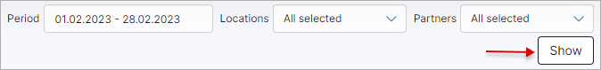

Customer internet usage
==================
In this section, we can view reports of customer internet usage.

The report is presented in a table format, the customer's status, billing information and other customer's details.

The table can be filtered by a specific period, partner or location with the use of the filter located at the top right of the table. To use the filter, simply specify the period, partner and/or location and click on the `Show` button:

This table, like all tables in Splynx, can be exported in a format of choice from that which is available. The table can also be customized to display data of your preferences ordered in a preferred layout. The following button can be used to export the table <icon class="image-icon"></icon> and this button <icon class="image-icon"></icon> can be used to modify the layout of the table.

When using the export button, you will be presented with the following option as methods to export the table:

Simply click on the desired method to start the desired export.

When using the modify button, you will be presented with the following window:

In this window, you can simply enable or disable each field according to your preference with the toggles provided. You also can drag and drop the field to order it in a layout of your choice.
