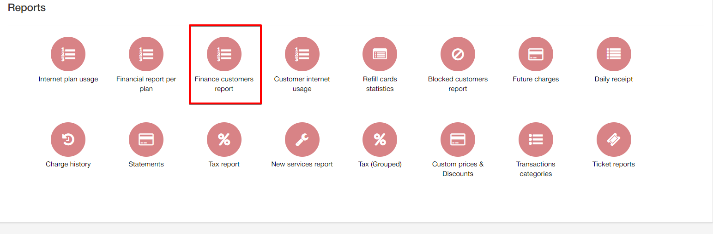
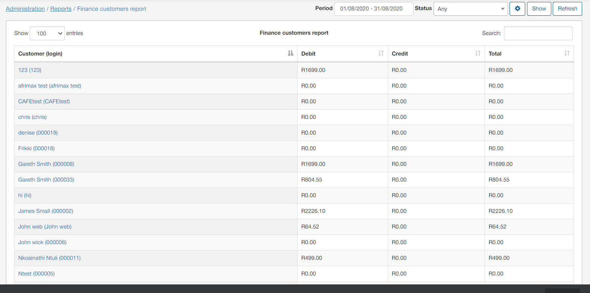
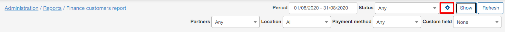
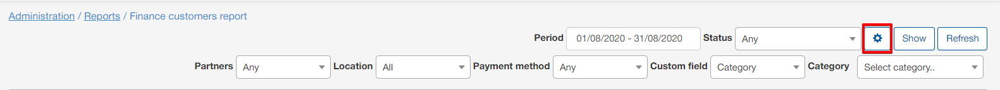
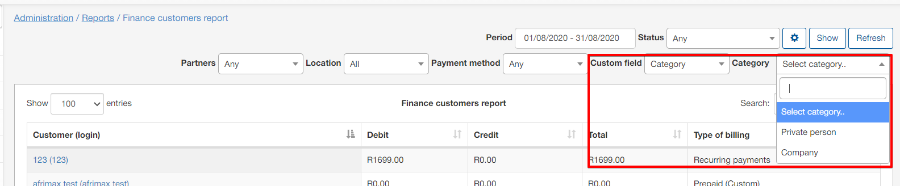
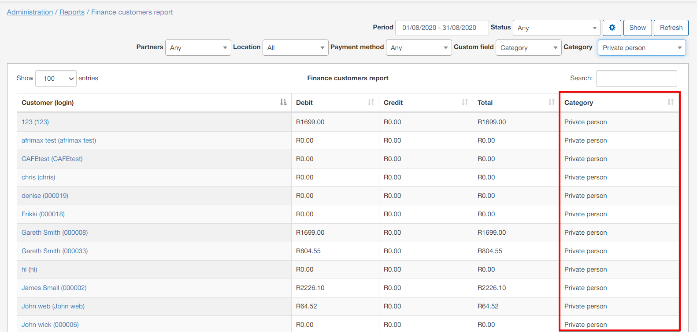

Finance Customers Report
=========

This section displays a report of customer finances. The report displays a total of credit and debit transaction amounts, as well as a total amount of funds for credit VS debit transactions. Showing the total amount of funds due to the customer or is owed by the customer.

The report is presented in a table format which can be filtered by a specific period or customer status. The filter can also be used to display data of a particular partner, location, payment type or custom field.

When using the custom field filter, it is then necessary to select the parameter thereof. For example, we've selected the custom field "Category", custom fields in this section of Splynx refers to a custom search field in the customer module. This means that data will be retrieved based on the select of the field and the parameter specified. Therefore, "Category" in this sense, refers to the customer category, giving available parameter; Company or Private person:

Once the filter has been applied, the table will then display the data with the custom fields included in the table:

Additionally, this table, like all tables in Splynx, can be exported in a format of choice from that which is available. The table can also be customized to display data of your preferences ordered in a preferred layout. The following button can be used to export the table  and this button  can be used to modify the layout of the table.

When using the export button, you will be presented with the following option as methods to export the table:

Simply click on the desired method and a download will begin.

When using the modify button, you will be presented with the following window:

In this window, you can simply enable or disable each field according to your preference with the toggles provided, and you can drag and drop the field to order it in a layout of your choice.
