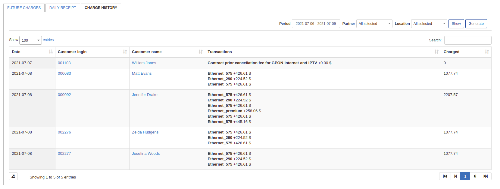
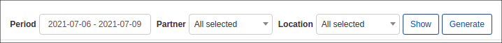
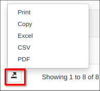

Charge History
============

In this section, we can view a report of all charges executed in the system.

The report is presented in a table format and displays a list of all charges for all customers, the transactions for the charge relevant to the tariff plan, with a date and the total that the customer has been charged for the period specified.

The table can be filtered by a specific period, partner and/or location with the use of the filter provided at the top right of the table. Simply specify the period, partner and/or location and click on the show button to display the result of the criteria you have specified.

This table can be exported in a format of your preference of that which is available. Simply click on the export  button located at the bottom of the table and choose a preferred method of exporting:

