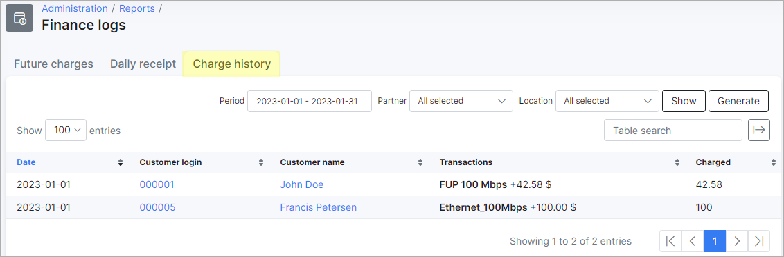
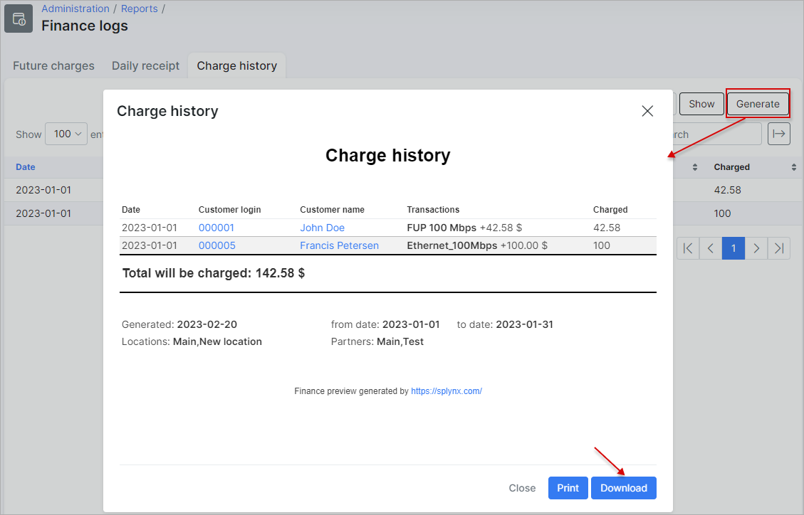

Charge History
============

In this section, we can view a report of all charges executed in the system.

The report is presented in a table format and displays a list of all charges for all customers, the transactions for the charge relevant to the tariff plan, with a date and the total that the customer has been charged for the period specified.

The table can be filtered by a specific period, partner and/or location with the use of the filter provided at the top right of the table. Simply specify the period, partner and/or location and click on the `Show` button to display the result of the criteria you have specified.

Also, you can click on the `Generate` button to download an HTML copy of the table.

This table can be exported in CSV format, simply click on the export <icon class="image-icon"></icon> button located at the bottom of the table to download CSV file:

