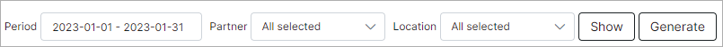

Charge History
============

In this section, we can view a report of all charges executed in the system.

The report is presented in a table format, which lists all charges for each customer, including transactions related to their tariff plan, along with the relevant dates and total charges for the specified period:

You can filter the table by selecting a specific period, partner, and/or location using the provided filter at the top right of the table. Once you have specified the criteria, click on the `Show` button to display the results.

Also, you can click on the `Generate` button to download an HTML copy of the table.

This table can be exported in CSV format. Simply click on the export <icon class="image-icon"></icon> button located at the top of the table to download a CSV file:

