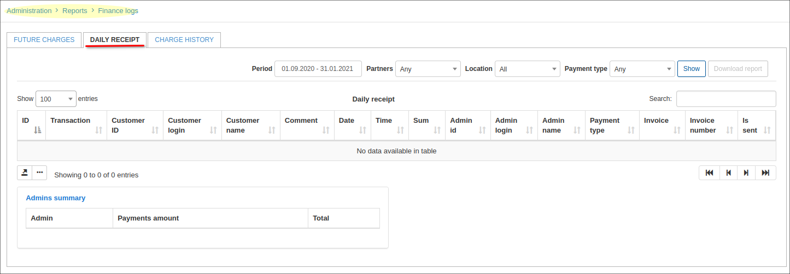
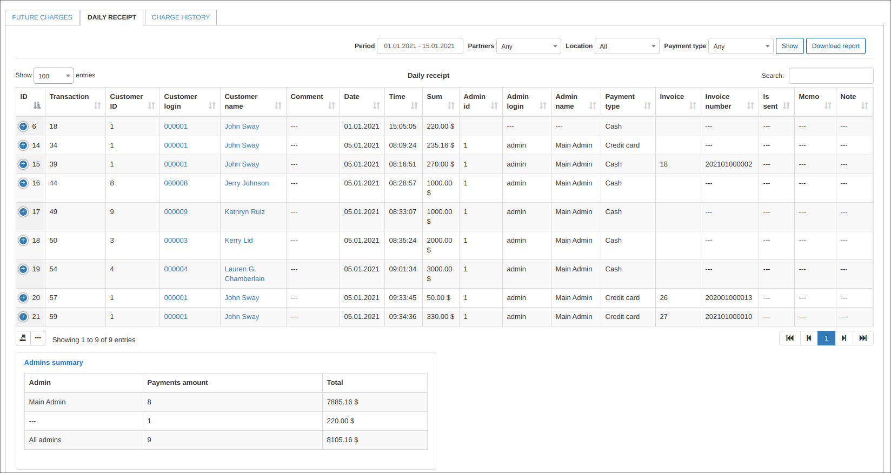
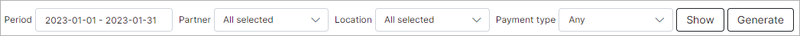
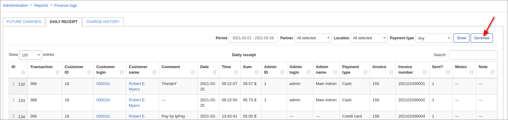
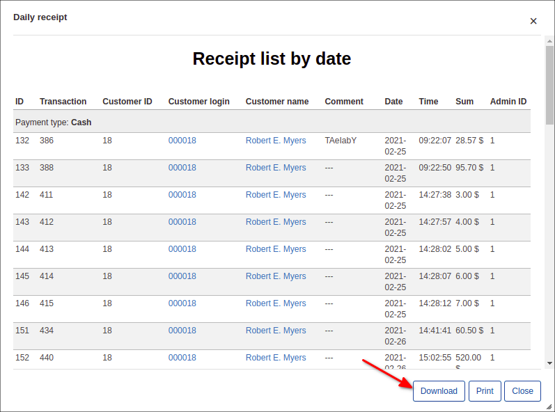
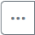
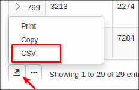
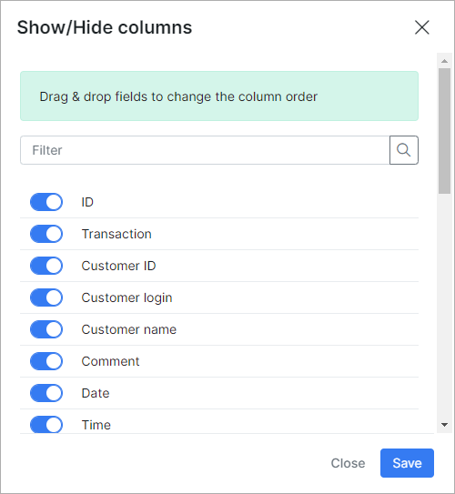

Daily Receipt
=========

This section displays a report of all payments made in the system. The report is presented in a table format, displaying the customer name, comments of the payment, payment details, the administrator's details who has added the payment, payment details, as well as invoice and receipt numbers for each payment.

The data can be filtered to display a receipt of payments made in a specified period, by a particular partner, location and/or payment type. The filter located at the top right of the table can be used by simply specifying your desired criteria and clicking on the "Show" button:

Upon clicking the "Show" button, the data will be displayed according to your criteria. You can then use the download button to download the result of your specified criteria:

Upon clicking on the download button you will be presented with the following window:

Simply click on the download button to download an HTML copy of the receipt or print to print it.

This table, like all tables in Splynx, can be exported in a format of choice from that which is available. The table can also be customized to display data of your preferences ordered in a preferred layout. The following button can be used to export the table  and this button  can be used to modify the layout of the table.

When using the export button, you will be presented with the following option as methods to export the table:

Simply click on the desired method and a download will begin.

When using the modify button, you will be presented with the following window:

In this window, you can simply enable or disable each field according to your preference with the toggles provided, and you can drag and drop the field to order it in a layout of your choice.
