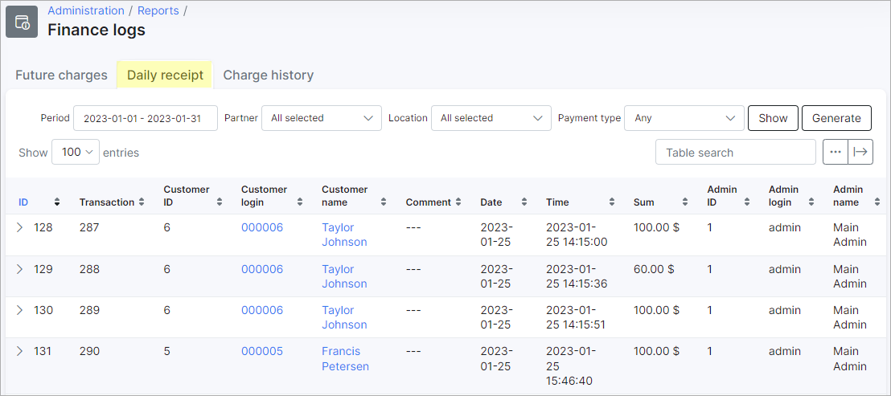

Daily Receipt
=========

This section displays a report of all payments made in the system. The report is presented in a table format, with columns for the customer name, payment comments, payment details, administrator details, invoice number, and receipt number. 

Each row represents a single payment transaction and includes all of the relevant details. The administrator's details are also included for each payment, indicating who added the payment to the system.

The data can be filtered to display a receipt of payments made during a specified period, by a particular partner, location and/or payment type. The filter can be used by simply specifying your desired criteria and clicking on the `Show` button, located at the top right of the table:

Upon clicking the `Show` button, the data will be displayed according to your criteria. You can then use the `Generate` button to download the result of your specified criteria.

Upon clicking the `Generate` button you will be presented with the following window:

Simply click the `Download` button to download an HTML copy of the receipt or `Print` - to print it.

Like all tables in Splynx, this table can be exported in the format of your choice from the available options. The table can also be customized to display data of your preferences ordered in a preferred layout. The following button can be used to export the table <icon class="image-icon"></icon> and this button <icon class="image-icon"></icon> can be used to modify the layout of the table.

When you use the export button, you will be able to export the table as a CSV file:

With the modify button, the following window will appear:

In this window, you can simply enable or disable each field according to your preferences with the toggles provided, and you can drag and drop the field to order it in the layout of your choice.
