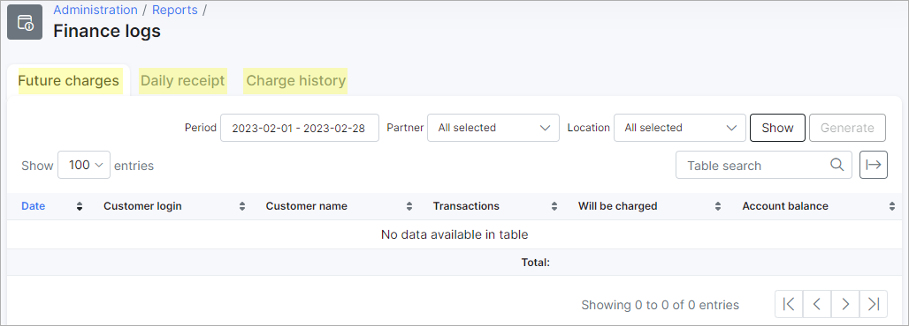

Finance log
==============

This section includes three separate reports: *Future charges*, *Daily receipt*, *Charge history*. Such combination provides a fuller context for the finance situation in your Splynx system.

* [Future charges](administration/reports/finance_logs/future_charges/future_charges.md)

* [Daily Receipt](administration/reports/finance_logs/daily_receipt/daily_receipt.md)

* [Charge History](administration/reports/finance_logs/charge_history/charge_history.md)
