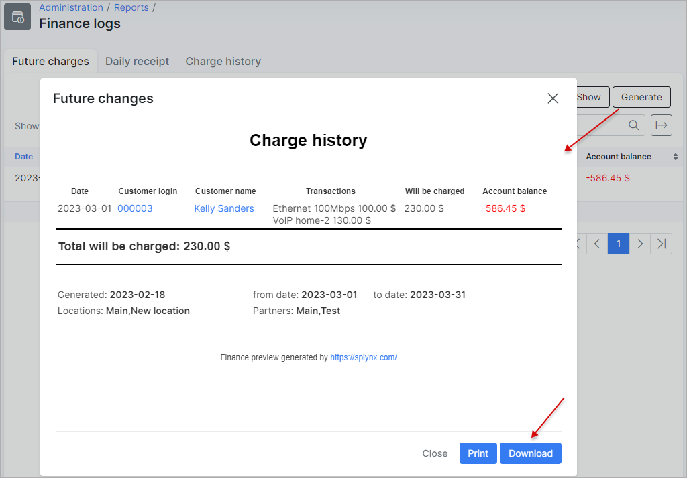

Future charges
=======

This tab displays a report of all future charges that will be charged to customer accounts according to their prescribed services. The report displays the date of the charge, the transactions that will be charged relevant to the services, an amount of the charges, and a calculated total of the customers account balance after the charges have been applied.

The report is presented in a table format as depicted below:

The table conveniently displays the total funds that will be charged to all customers.

The table can be filtered to display data pertaining to a specific period, partner and/or location. Simply specify the criteria and click on the `Show` button to retrieve the data of your criteria.
Also, you can click on the `Generate` button to download an HTML copy of the table or alternatively, you can use the export <icon class="image-icon"></icon> icon located at the top right of the table, to export the table to *CSV* format:

