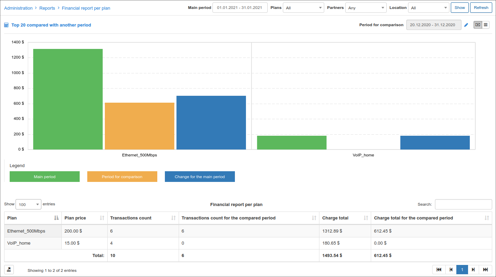

Financial report per plan
==========

This is a report displaying a financial report of all tariff plans on the system. The report displays the tariff name, a count of customers subscribed to the plan and a total amount of funds each plan has generated charges for, as well as discounts if any were recorded. The report also displays a total amount for all tariffs, discounts, and a total for the charge total - discounts.

The report is presented in a table format as depicted below:

The table can be filtered by a specific period, type of plan, a particular partner, and/or location. With the use of the filter located at the top right of the table, simply specify the criteria of your desire and click on show to retrieve the results of your criteria.

This table can be exported for reference purposes with the use of the export  icon located at the bottom left of the table, in a format of your choice, from the methods available.

