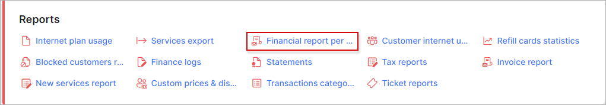
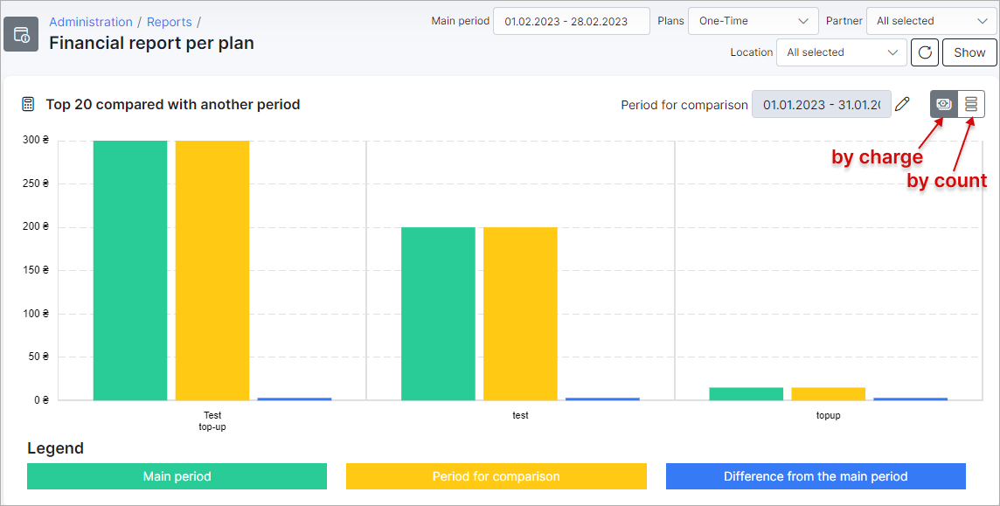

Financial report per plan
==========

This is a report displaying financial statistics of all tariff plans on the system. The report displays the tariff name, a count of transactions according to the plan and a total amount of funds each plan has generated for the compared period. The report shows the chart with *Top 20* plans for better visualisation. The chart can be persented *by charge* or *by count*.

The report is presented in a table format as depicted below:

The table can be filtered by a specific period, type of plan, a particular partner, and/or location. With the use of the filter located at the top right of the table, simply specify the criteria of your desire and click on `Show` to retrieve the results.

This report can be exported with the use of the export <icon class="image-icon"></icon> icon, located at the top right of the table. The table can be exported in a format of your preference:

