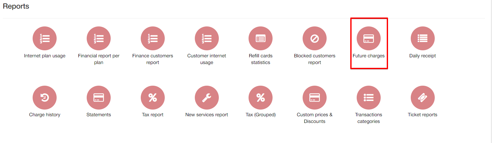
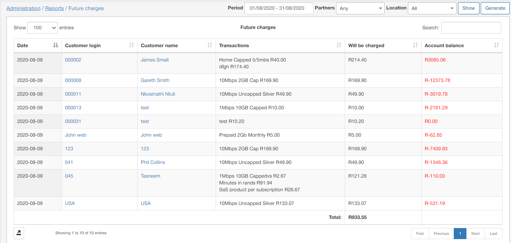

Future charges
=======

This section displays a report of all future charges that will be charged to customer accounts according to their prescribed services. The report displays the date of the charge, the transactions that will be charged relevant to the services, an amount of the charges, and a calculated total of the customers account balance after the charges will be applied.

The report is presented in a table format as depicted below:

The table also conveniently displays a total amount of funds which will be charged for all customers.

The table can be filtered to display data pertaining to a specific period, partner and/or location. Simply specify the criteria and click on the show button to retrieve the data of your criteria. You can then click on the generate button to download an HTML copy of the table or alternatively, you can use the export  icon located at the bottom left of the table, to export the table in a format of your preference from the methods available:

