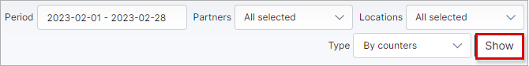

Internet plan usage
==========

This is a report of all customers internet usage pertaining to a particular plan. The report is presented in a table format, displaying the plan/tariff name, the count of customers subscribed to the plan, a total of download traffic, upload traffic, and download+upload traffic in total:

The table/report can be filtered to display data pertaining to a specific period, partner, and/or location. Simply specify the criteria in the filter bar located at the top right of the table and click on "Show" to retrieve the data according to your criteria.

This report can be exported with the use of the export  icon, located at the bottom left of the table. The table can be exported in a format of your preference from the methods available:

