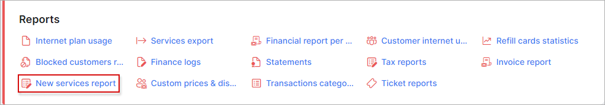
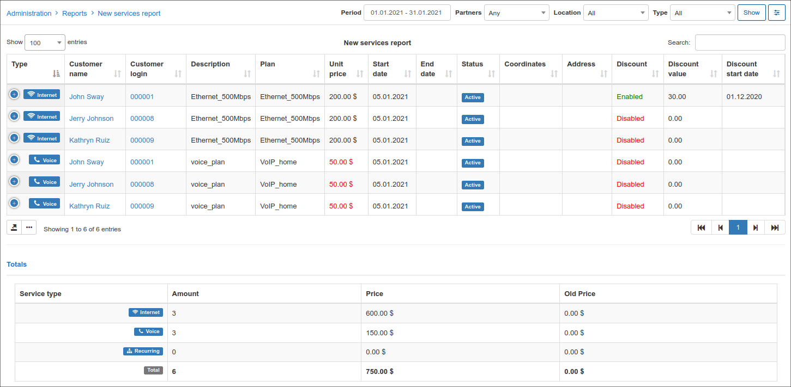
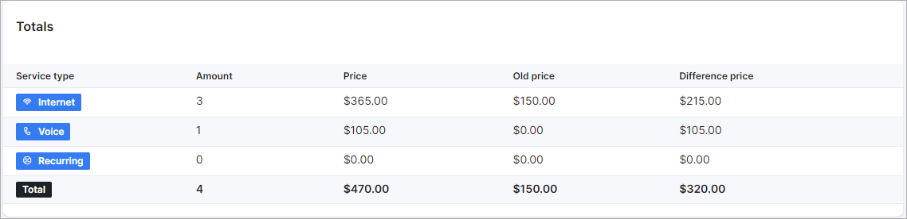
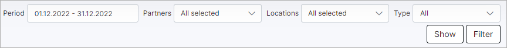
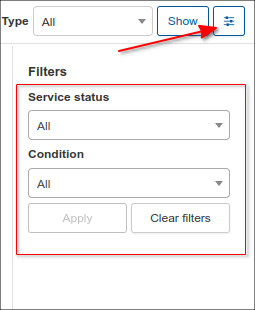
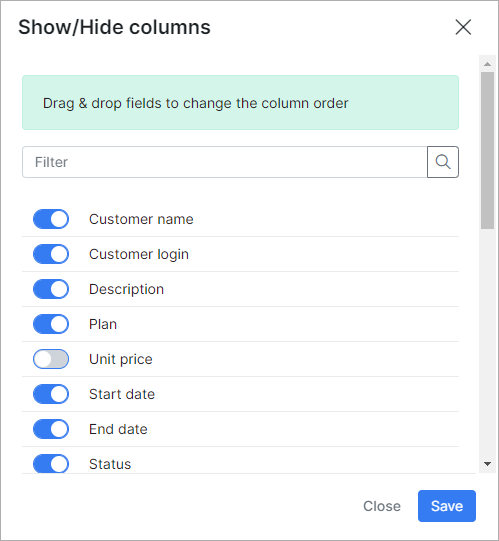

New services report
===============

This section provides a comprehensive report of all recently added customer services within the system. This report features a list of all tariffs that either have a start date set for the future or have been changed from a previous service. The report presents essential information such as the type of service, customer name, tariff plan details, and unit prices of each plan, along with the corresponding start and end dates.

The report is presented in a table format as depicted below:

 The table can be filtered to display data about a specific period, partner, location, or tariff type:

To display data that is specific to a particular service status and/or condition, you can use the `Filter` button located at the top-right of the table.

This table, like all tables in Splynx, can be exported in a format of choice from that which is available. The table can also be customized to display data of your preferences ordered in a preferred layout. The following button can be used to export the table <icon class="image-icon"></icon> and this button <icon class="image-icon"></icon> can be used to modify the layout of the table.

When using the export button, you will be presented with the following options as methods to export the table:

Click on the desired method and a download will begin.

When using the modify button, you will be presented with the following window:

In this window, you can customize the layout of fields by enabling or disabling them using the provided toggles. Additionally, you can drag and drop fields to order them according to your preference.
