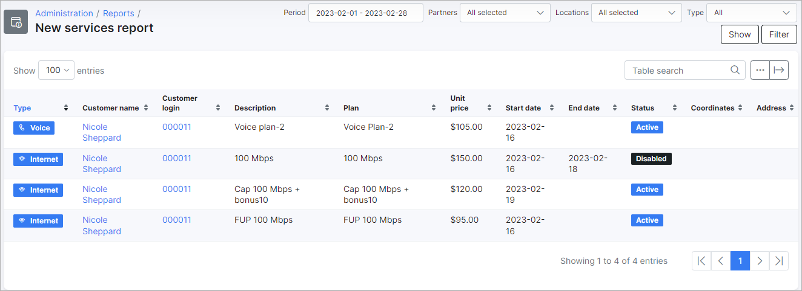
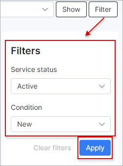

New services report
===============

This section displays a report of all new services of customers in the system, the report displays a list of all tariffs with a start date that has been set in the future or set to change to from an old service. The report displays the service type, customer details, tariff plan details, unit prices of the plans, as well as start and end dates of each plan.

The report is presented in a table format as depicted below:

The table can be filtered to display data pertaining to a specific period, partner and/or location, or tariff type:

The filter can be further customized to display data specific to a particular service status and/or condition with the use of a gear icon location with the filter at the top right of the table:

All entries on the report can be expanded to display the additional details of the tariff, like the period and discount details if any were applied. Simply click on the `+` icon on the tariff type in the table to expand and view the details:

This table, like all tables in Splynx, can be exported in a format of choice from that which is available. The table can also be customized to display data of your preferences ordered in a preferred layout. The following button can be used to export the table  and this button  can be used to modify the layout of the table.

When using the export button, you will be presented with the following option as methods to export the table:

Simply click on the desired method and a download will begin.

When using the modify button, you will be presented with the following window:

In this window, you can simply enable or disable each field according to your preference with the toggles provided, and you can drag and drop the field to order it in a layout of your choice.
