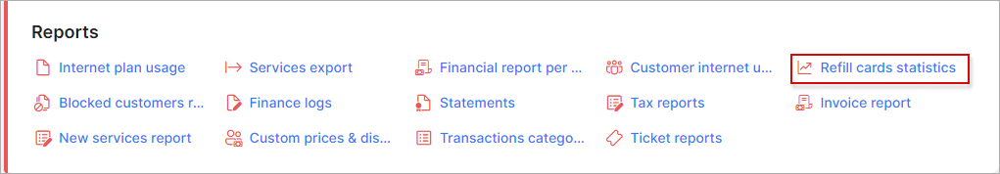
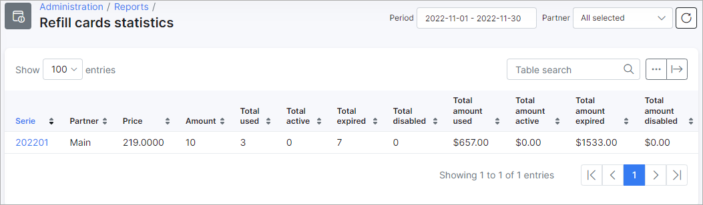

Refill cards statistics
================

This section displays a report of all refill cards/vouchers that have been generated in the system. The report is presented in a table format displaying the series of the refill cards/vouchers, the partner the vouchers pertain to and the price of the voucher, the total amount vouchers in the series, how many have been used, are active, is expired or disabled. The report also displays a total amount of funds for vouchers that have been used and is active, vouchers which have expired and are disabled:

The report can be filtered to display refill cards/vouchers pertaining to a specific period and partner with the use of the filter provided at the top right of the table.

The table/report can then be exported in a format of your preference from the methods available by mean of the export  icon located at the bottom left of the table:

