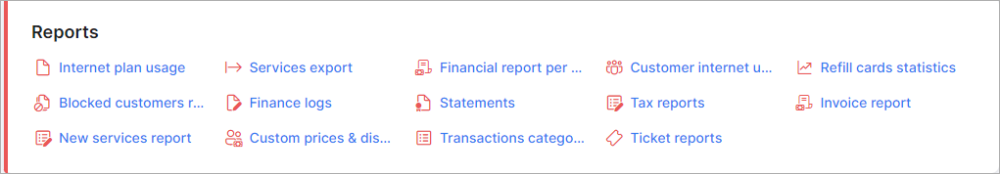

Reports
==================

In this section we can view various reports generated in the system.

* [Blocked customers report](administration/reports/blocked_customers_report/blocked_customers_report.md)

* [Charge history](administration/reports/charge_history/charge_history.md)

* [Custom prices & discounts](administration/reports/custom_prices_&_discounts/custom_prices_&_discounts.md)

* [Customer internet usage](administration/reports/customer_internet_usage/customer_internet_usage.md)

* [Daily receipt](administration/reports/daily_receipt/daily_receipt.md)

* [Finance customers report](administration/reports/finance_customers_report/finance_customers_report.md)

* [Financial report per plan](administration/reports/financial_report_per_plan/financial_report_per_plan.md)

* [Future charges](administration/reports/future_charges/future_charges.md)

* [Internet plan usage](administration/reports/internet_plan_usage/internet_plan_usage.md)

* [New services report](administration/reports/new_services_report/new_services_report.md)

* [Refill cards statistics](administration/reports/refill_cards_statistics/refill_cards_statistics.md)

* [Statements](administration/reports/statements/statements.md)

* [Tax grouped](administration/reports/tax_grouped/tax_grouped.md)

* [Tax report](administration/reports/tax_report/tax_report.md)

* [Tickets report](administration/reports/tickets_report/tickets_report.md)

* [Transaction categories](administration/reports/transaction_categories/transaction_categories.md)
