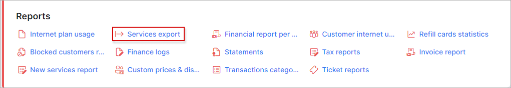
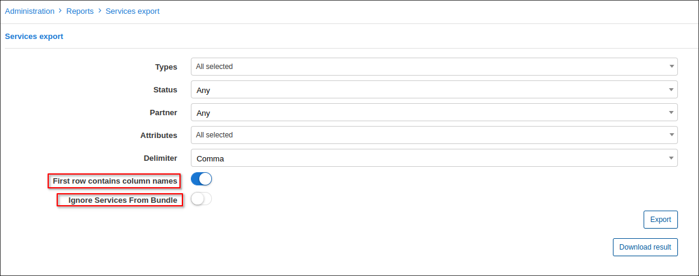
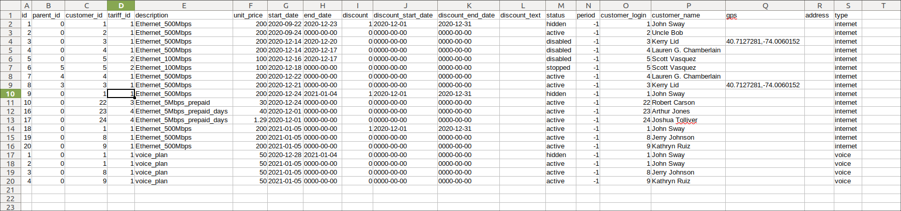

Services Export
==============

In this section we can export the existing *Internet/Voice/Recurring/Bundle* services in relation to customers in Splynx as CSV file. The report can include the information about services in any status, the different attributes, such as price, discount start/end date, GPS coordinates, customer login etc. The name of columns' fields or services from *Bundles* can be ignored using the toggles as follows

After selecting the necessary export options and pressing *Export* button, the new button - *Download result* will appear. Press this button to download CSV file.

