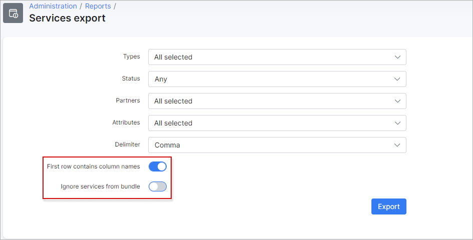

Services Export
==============

In this section we can export the existing *Internet/Recurring/Bundle* services in relation to customers in Splynx as a CSV file. The report can include the information about services in any status, different attributes such as price, discount start/end date, GPS coordinates, customer login etc. The name of columns' fields or services from *Bundles* can be ignored using the toggles as follows:

After selecting the necessary export options and pressing the `Export` button, a new button - `Download result` will appear. Press this button to download a CSV file.

