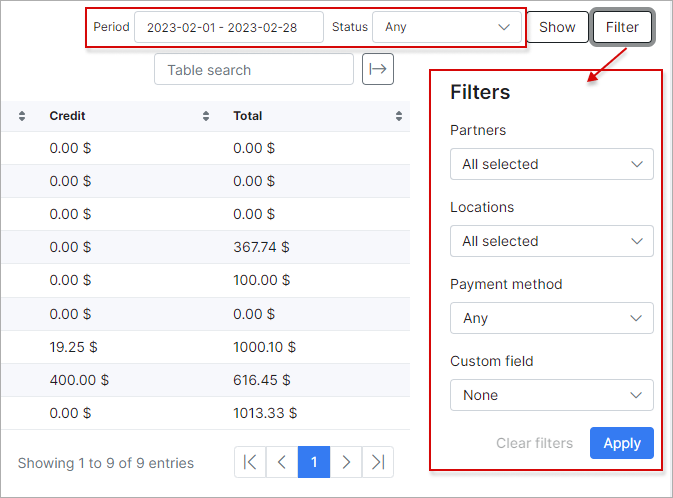

Statements
===========

In **Statements** section, we can view a report of customer financial statements specifically regarding transactions and invoices VS payments. The report is represented in a table format and specifically displays data specified in the filter criteria. Therefore, it is necessary to specify what kind of report you wish to display, being either transactions or invoices/payments. Simply use the filter located at the top right of the table to select a period and the type of data to display, then click on show:

Upon clicking on "Show" the data will be retrieved according to your criteria:

You can further specify the data you wish to display with the use of the filter - *Advanced search*:

You can then filter the data to display results pertaining to a specific partner and/or location, or a specific customer, or even a customer category:

Once you have filtered the table/report to display data of your preference, you can then download a PDF copy of the report/table with the use of the "Generate PDF" button located within the filter. Upon clicking on *Download generated* button, a download will begin automatically, downloading a ZIP file containing PDF statements for each customer according to the data criteria you have specified in the filter. Also, you can send PDF files to customers using *Send to customers* button.

You can then locate this zip file in your downloads folder and view each statement downloaded:

)

Additionally, the actual table can also be exported in a format of your preference from the methods available with the use of the export <icon class="image-icon"></icon> icon located at the bottom left of the table:

In **Finance Customers Report** tab, we can check a report of customer finances. The report displays a total of credit and debit transaction amounts, as well as a total amount of funds for credit VS debit transactions. Showing the total amount of funds due to the customer or is owed by the customer.

The report is presented in a table format which can be filtered by a specific period or customer status. The filter can also be used to display data of a particular partner, location, payment method or custom field.

When using the custom field filter, it is then necessary to select the parameter thereof. For example, we've selected the custom field "Category", custom fields in this section of Splynx refers to a custom search field in the customer module. This means that data will be retrieved based on the select of the field and the parameter specified. Therefore, "Category" in this sense, refers to the customer category, giving available parameter; Company or Private person:

Once the filter has been applied, the table will then display the data with the custom fields included in the table:

Additionally, this table, like all tables in Splynx, can be exported in a format of choice from that which is available. The table can also be customized to display data of your preferences ordered in a preferred layout. The following button can be used to export the table <icon class="image-icon"></icon> and this button <icon class="image-icon"></icon> can be used to modify the layout of the table.

When using the export button, you will be presented with the following option as methods to export the table:

Simply click on the desired method and a download will begin.
