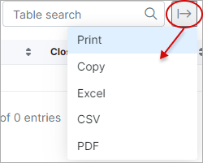

Statements
===========

In this section, we can view a report of customer financial statements specifically regarding transactions and invoices VS payments. The report is represented in a table format and specifically displays data specified in the filter criteria. Therefore, it is necessary to specify which kind of report you wish to display, being either transactions or invoices/payments. Simply use the filter located at the top right of the table to select a period and the type of data to display, then click on show:

Upon clicking on "Show" the data will be retrieved according to your criteria:

You can further specify the data you wish to display with the use of the gear icon within the filter:

You can then filter the data to display results pertaining to a specific partner and/or location, or a specific customer, or even a customer category:

Once you have filtered the table/report to display data of your preference, you can then download a PDF copy of the report/table with the use of the "Generate PDF" button located within the filter. Upon clicking this button, a download will begin automatically, downloading a ZIP file containing PDF statements for each customer according to the data criteria you have specified in the filter.

You can then locate this zip file in your downloads folder and view each statement downloaded:

Additionally, the actual table can also be exported in a format of your preference from the methods available with the use of the export  icon located at the bottom left of the table:

