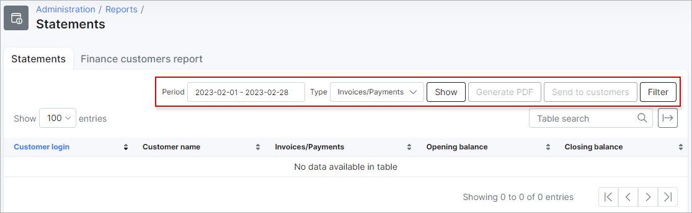
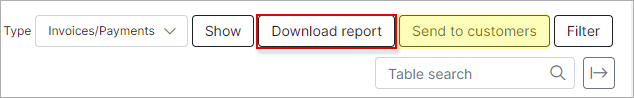
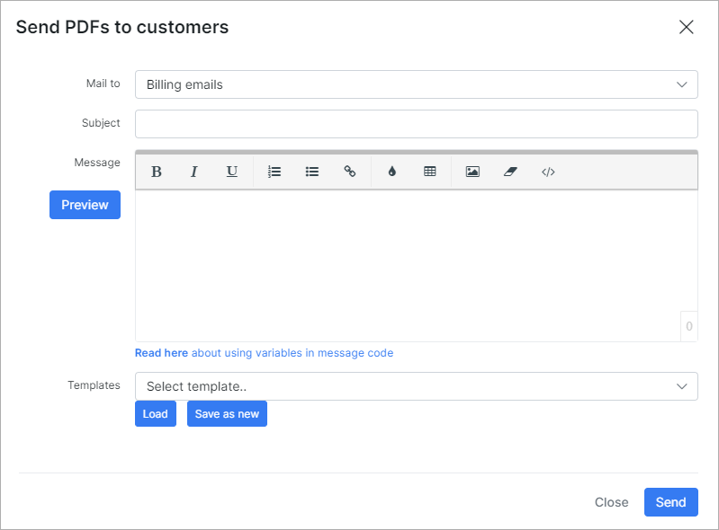
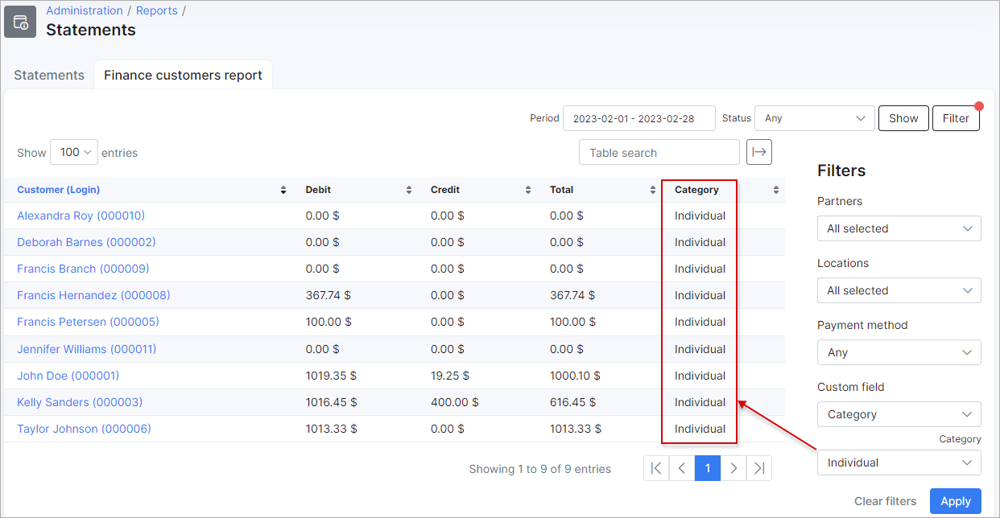

Statements
===========

## Statements

In the **Statements** section, we can view a report of customer financial statements specifically regarding transactions and invoices VS payments. The report is represented in a table format and specifically displays data specified in the filter criteria. Thus, it is necessary to specify what kind of report you wish to display, either transactions or invoices/payments.

Use the filter located at the top right of the table to select a period and the type of data to display, then click on `Show`:

Upon clicking on `Show`, you can retrieve the data according to your criteria:

You can further specify the data you wish to display with the use of the filter.
To display specific results, you can filter the data by partner and/or location, a particular customer, or a customer category:

After filtering the table or report to display the data you want, you can download a PDF copy using the `Generate PDF` button at the top of the table: 

When you click on the `Download report` button, a download will begin, providing a ZIP file with PDF statements for each customer based on the data criteria you've set in the filter.

Additionally, you can send PDF files to customers using the `Send to customers` button.

You can then locate this zip file in your downloads folder and view each statement downloaded:

Additionally, the actual table can also be exported in a format of your preference from the methods available with the use of the export <icon class="image-icon"></icon> icon located at the top right of the table:

## Finance customers report

In the **Finance customers report** tab, we can check a report of customer finances. The report displays the total credit and debit transaction amounts, as well as the total amount of funds for credit vs debit transactions, showing the total amount of funds due to the customer or owed by the customer.

The report is presented in a table format which can be filtered by a specific period or customer status. The filter can also be used to display data of a particular partner, location, payment method or custom field.

When using the custom field filter, it is then necessary to select the parameter thereof. For example, we've selected the custom field "Category", custom fields in this section of Splynx refer to a custom search field in the customer module. This means that data will be retrieved based on the selection of the field and the parameter specified. Therefore, *Category* in this sense, refers to the customer category, giving an available parameter: *Individual* or *Business*:

Once the filter has been applied, the table will then display the data with the custom fields included in the table:

Additionally, this table, like all tables in Splynx, can be exported in a format of choice from that which is available. The table can also be customized to display data of your preferences ordered in a preferred layout. The following button can be used to export the table <icon class="image-icon"></icon> and this button <icon class="image-icon"></icon> can be used to modify the layout of the table.

When using the export button, you will be presented with the following option as methods to export the table:

Simply click on the desired method and a download will begin.
