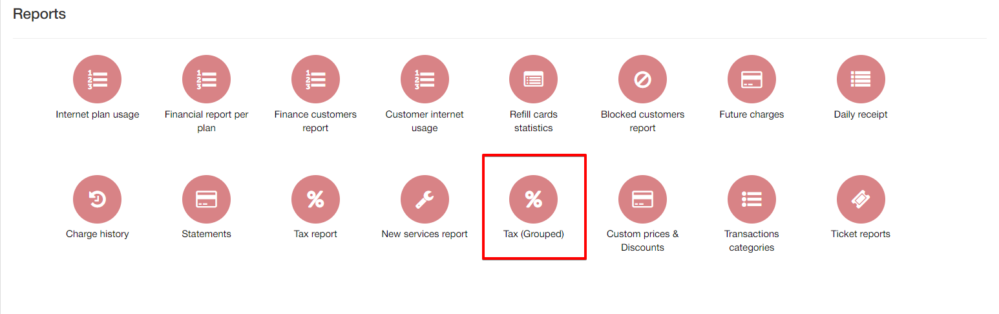
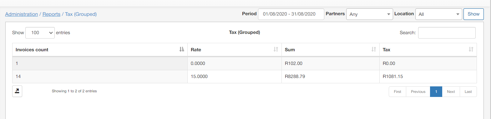

Tax grouped
===========

This section displays a report of all taxes configured under `Config/Finance/Taxes`. The report displays a count of invoices pertaining to a specific tax, the tax rate itself, the sum of all invoice amounts pertaining to the tax and a total amount of funds that was charged for the specific tax

The report is presented in a table format and can be filtered by a specific period, partner and/or location. Simply specify the criteria to you preference in the filter located at the top right of the table and click on show to retrieve the results according to your criteria:

The table can be exported by means of the export  icon located at the bottom left of the table. You can then export the table in a format of your preference from that which is available:

