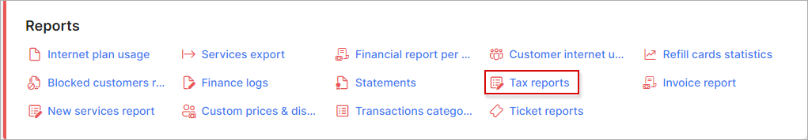

Tax report
=============

In *Tax Report* tab, we can display a detailed report of customers pertaining to a particular tax. The report is represented in a table format which groups customers by the relevant tax rates recorded in the system. The report displays customer details, financial records like invoice and transaction ID's relevant to the VAT or tax rate and financial total details like, the rate amount, the net amount per invoice, the rate/VAT amount and a gross total of each entry.

In *Tax Grouped report* tab, we can display a grouped report of all customer. The table includes the total invoices count according to the rate, its sum and tax amount.

The table can be filtered by a specific period, partner and/or location with the use of the filtered located at the top left of the table. Once you have specified you desired criteria, you can then click on show to display the results according to your criteria, you can then use the "generate" button to download an HTML copy of the report or choose to print it:

Upon clicking on this button, you will be presented with the following window, where you can choose the action you wish to execute:

Additionally, this table can also be exported in a format of your choice of the methods available with the use of the export <icon class="image-icon"></icon> icon located at the bottom left of the table:

