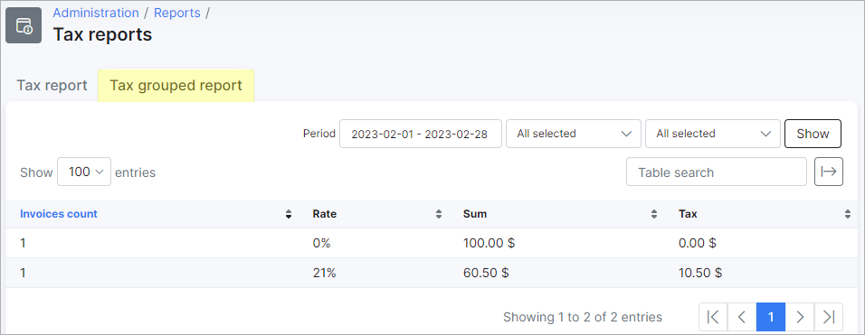

Tax report
=============

## Tax report tab

To view a detailed report of customers associated with a specific tax, simply navigate to the *Tax Report* tab. The report will be presented in a table format, which groups customers by the relevant tax rates that are recorded in the system.

In the report, you'll be able to see customer details, such as their name and contact information, as well as financial records like invoice and transaction IDs that are relevant to the VAT or tax rate. Additionally, the report will display financial total details, such as the rate amount, the net amount per invoice, the rate/VAT amount, and the gross total of each entry.

## Tax grouped report tab

In the *Tax Grouped report* tab, we can display a grouped report of all customers. The table includes the total invoices count according to the rate, sum, and tax amount.

______________________________________
You can filter the table by a specific period, partner, or location using the filter located at the top right of the table. After specifying your criteria, click on the `Show` button to display the results. You can then download an HTML copy of the report by clicking the `Generate` button or choosing to print it.

Upon clicking on the `Generate` button, you will be presented with the following window, where you can choose the action you wish to execute:

Additionally, this table can also be exported in a format of your choice of the methods available with the use of the export <icon class="image-icon"></icon> icon located at the top right of the table:

