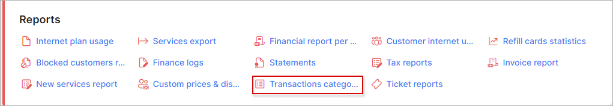
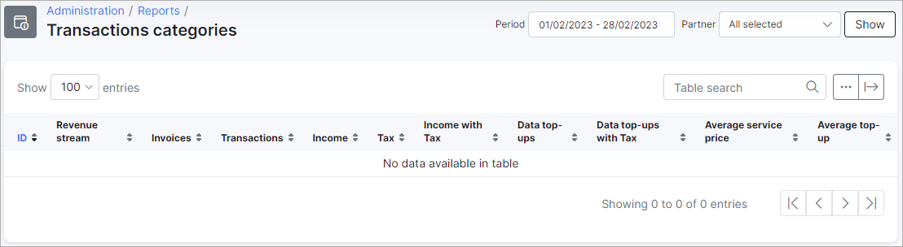
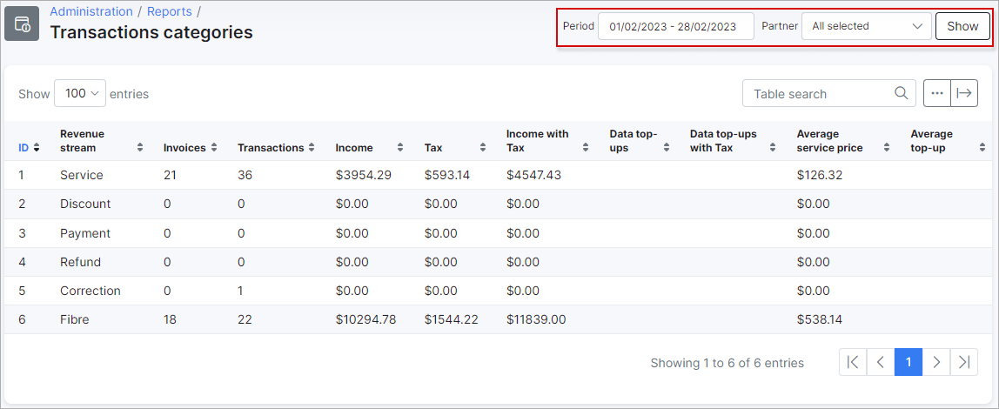
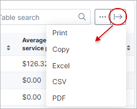
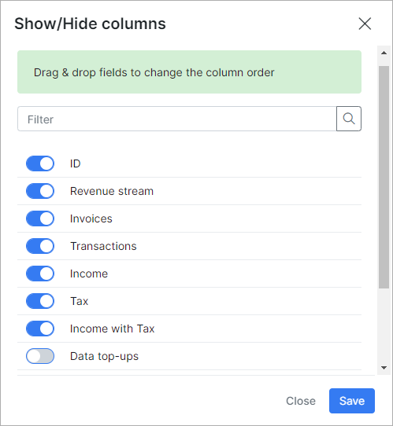

Transaction Categories
=============

In this section, we can view a report of all transaction categories in the system, the report is presented in a table format displaying services that generate revebue streams, financial details like transaction and invoice amounts, income and tax, income including tax, data top-up amounts with and without tax, as well as an average income price and an average income price for top-ups

To display any data, it is necessary for you to specify a criteria of results in the filter located at the top right of the table. You can filter data to display results for a specific period and partner, once done, simply click on show to view the results of your criteria.

This table, like all tables in Splynx, can be exported in a format of choice from that which is available. The table can also be customized to display data of your preferences ordered in a preferred layout. The following button can be used to export the table  and this button  can be used to modify the layout of the table.

When using the export button, you will be presented with the following option as methods to export the table:

Simply click on the desired method and a download will begin.

When using the modify button, you will be presented with the following window:

In this window, you can simple enable or disable each field according to you preference with the toggles provided, and you can drag and drop the field to order it in a layout of you choice.
