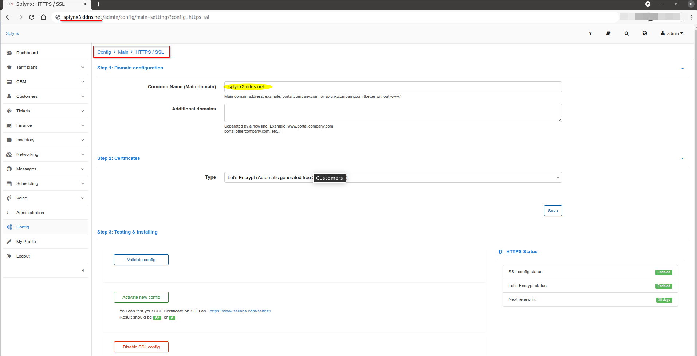
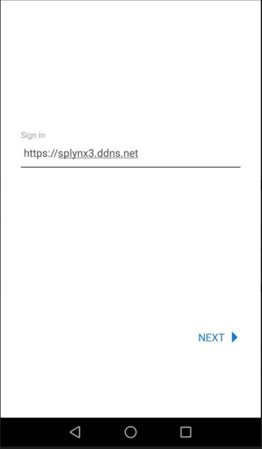
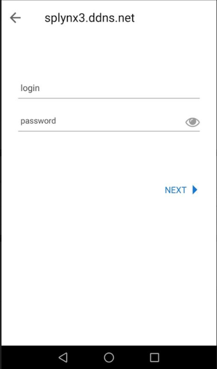
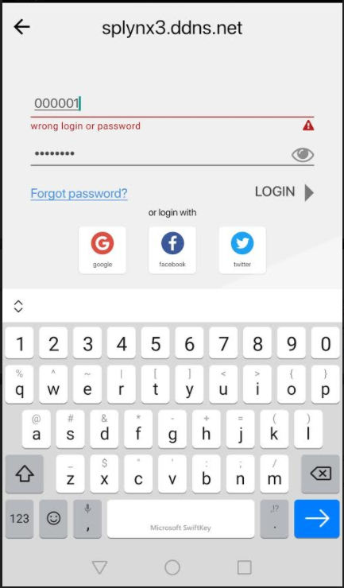
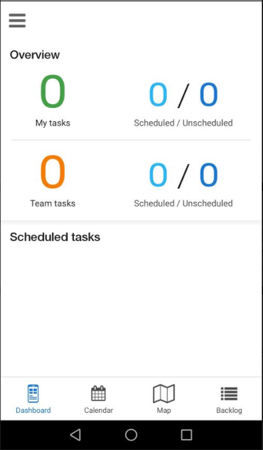
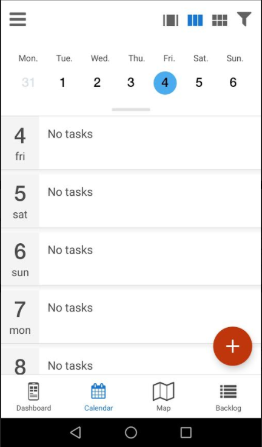
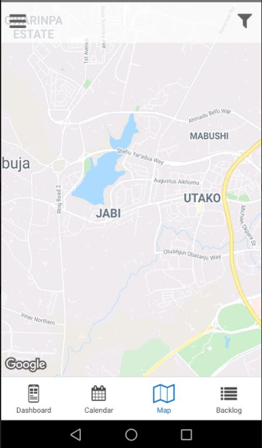
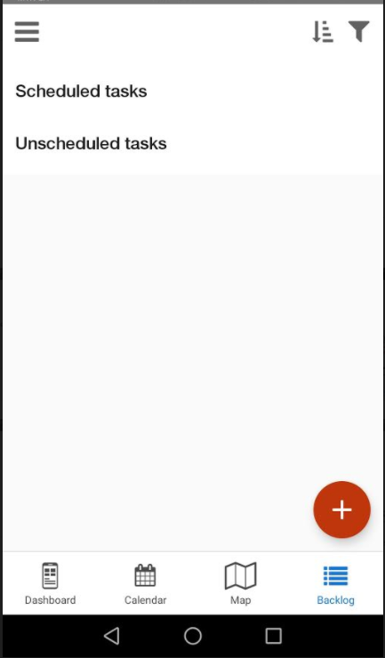
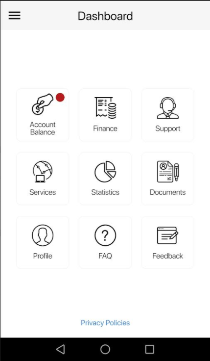

Splynx apps
=========

We are happy to present our mobile applications for a more comfortable approach to working with our product on mobile devices. The apps connect to Splynx via API.  The applications work on android and IOS platforms.

To be able to use the Splynx mobile applications, it is required that your Splynx server has already been configured with a public IP address and a public DNS name, as well as having HTTPS/SSL configured on your splynx server.

Once these configurations have been applied to your server, your server can then be reached using a URL:

This URL can then be used to access your server on both mobile applications:

The administrator or customer will have to use their details to log in:

Thereafter, depending on which mobile app was logged into they will be presented with the following:

## Scheduling:

## Customer:

Splynx offers two mobile applications, please click on each of the links below for more information:

* [Scheduling application](apps/scheduler_app/scheduler.md)

* [Customer application](apps/customer_app/customer_app.md)
