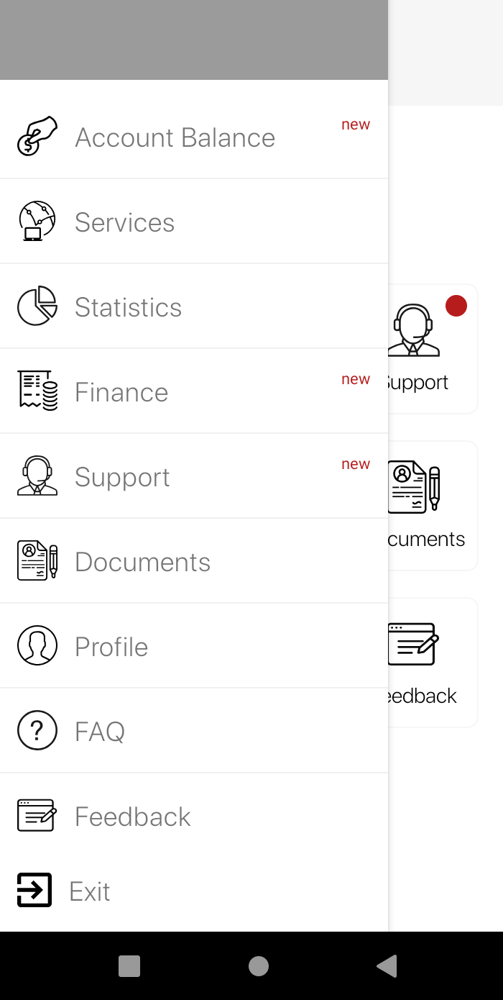
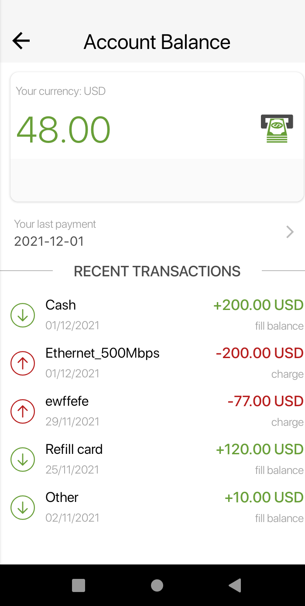
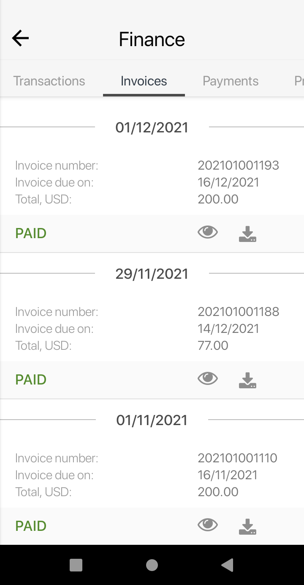
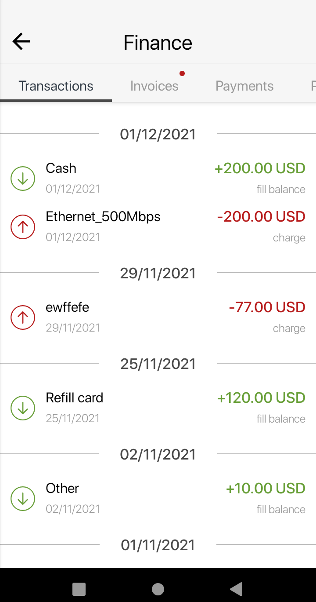
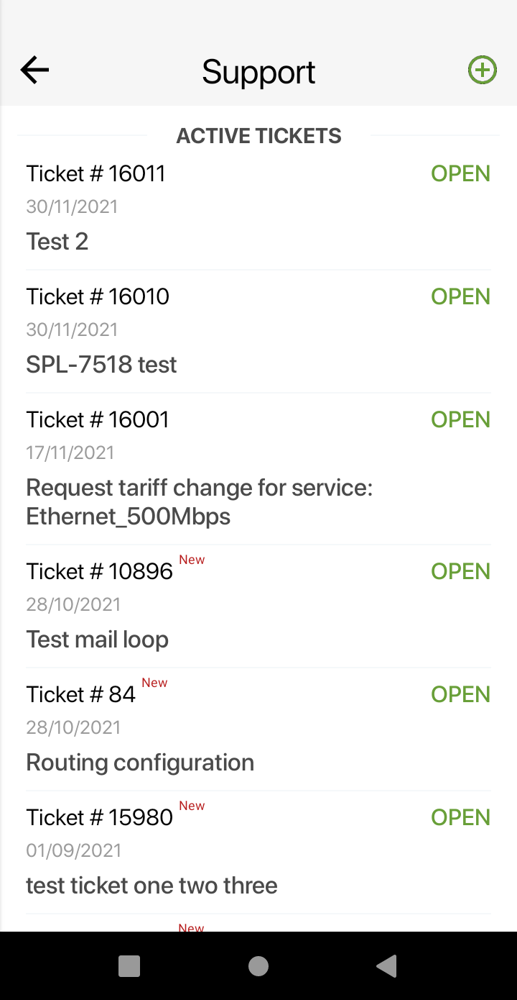

Customer Application
=========

The **Customer** app was designed to provide the best possible customer service.

  

  

To download the **Customer** app use the next links:

- on [Google Play for Android](https://play.google.com/store/apps/details?id=com.splynx.portal)
- on [App Store for iOS](https://apps.apple.com/us/app/splynx-customer-application/id1462886761)  

The app allows customers to do the following:

**Profile management and documents:**
* Change user information / account password
* Review uploaded documents
* Review F.A.Q

 **Finance management:**
* Check balance, (proforma) invoices, all transactions and payments
* Pay for their services online using a сredit сard
* Payment accounts management
* Setup a recurring payment subscription using their credit card or a payment gateway account
* Remove saved cards or bank accounts

**Services:**
* Change services and tariff plans
* Change password to their service

**Statistics**
* Check their Internet usage or VoIP services statistics

**Support:**
* Create/close or check the status of a support ticket and further communicate with a support representative via the app interface.
