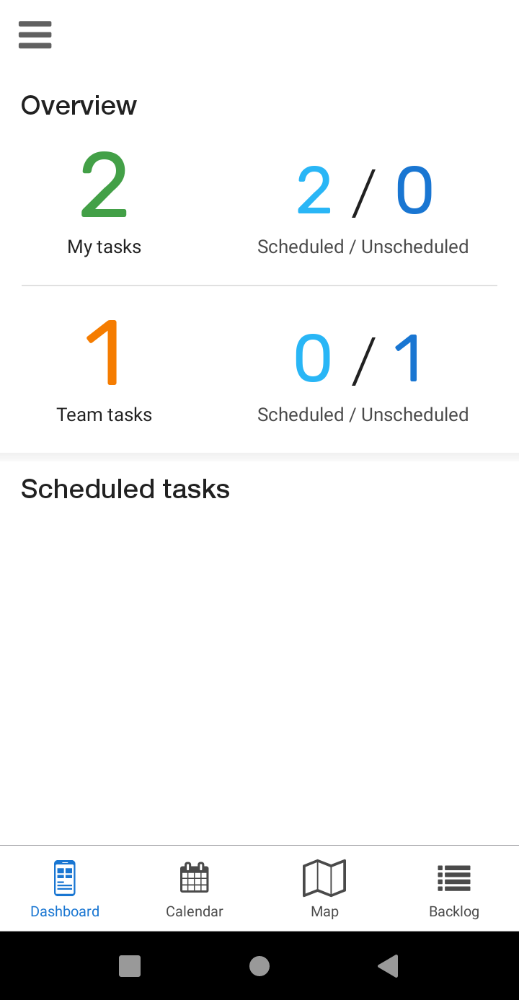
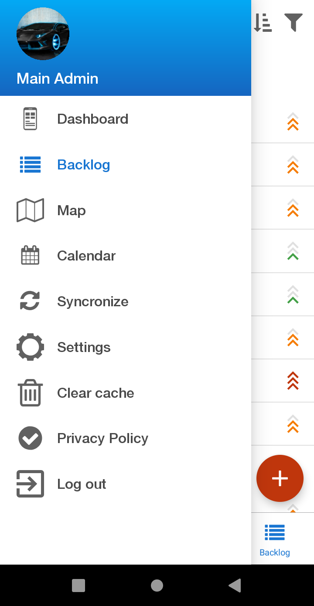
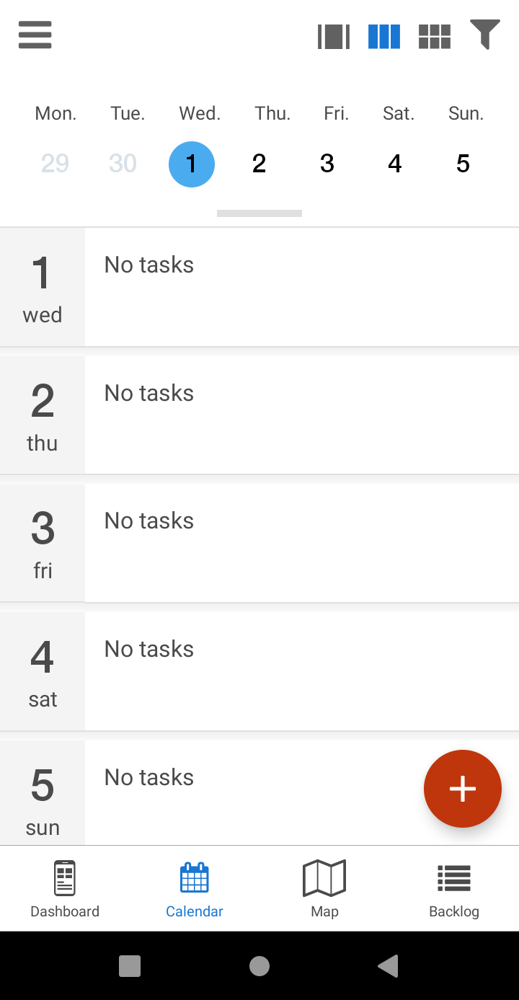
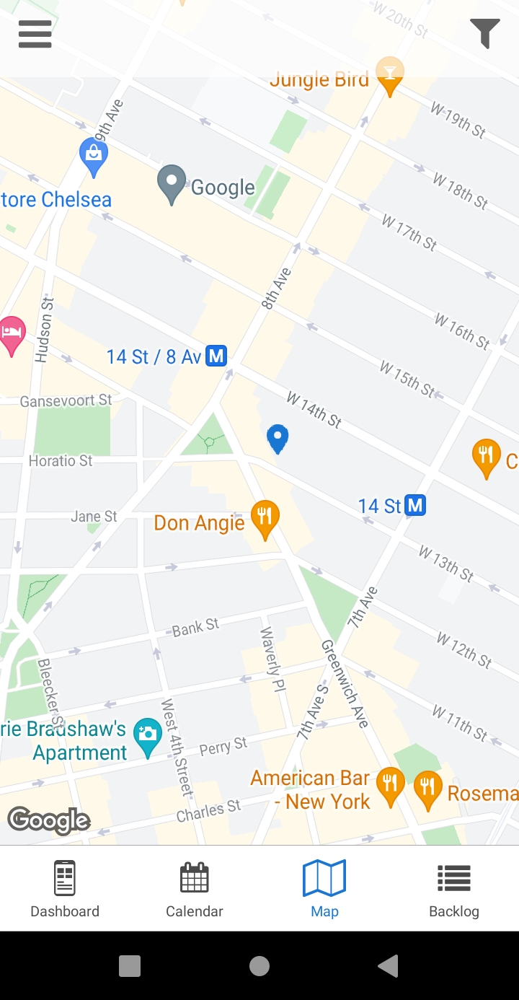
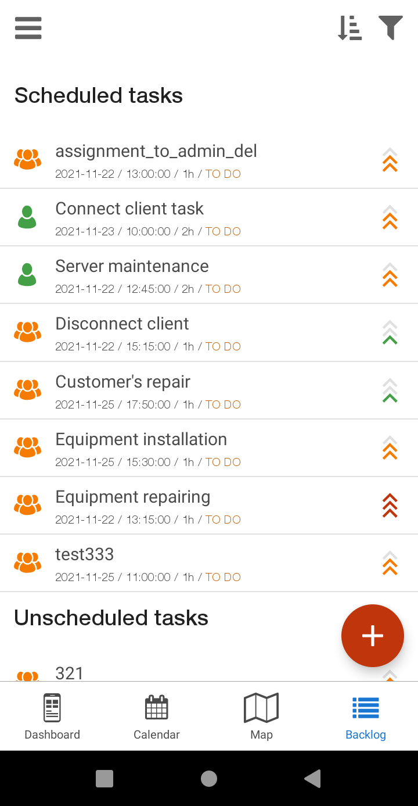

Scheduling Application
=========

The **Scheduling** app provides you with quick and efficient task management in the field. All tasks are located on a central platform, ready for your technicians to complete their job with ease and keep you informed at all times. Their time is also managed by the integrated calendar, allowing them to quickly and efficiently navigate through scheduled jobs. Gone are the days of printed work orders - all task details, checklists, time spent and customer information are easily accessible. The integration with maps also makes it easy to track the location of all tasks.

  

  

To download the **Scheduling** app use the next links:

- on [Google Play for Android](https://play.google.com/store/apps/details?id=com.scheduling)
- on [App Store for iOS](https://apps.apple.com/us/app/splynx-scheduler-application/id1476053290)

**Important**

For optimal and error-free work off **Scheduling** app, make sure that the engineers/technicians, who will use the application, have the following permissions in Splynx:

[Permissions](apps/scheduler_app/scheduler_app_permissions/scheduler_app_permissions.md)
