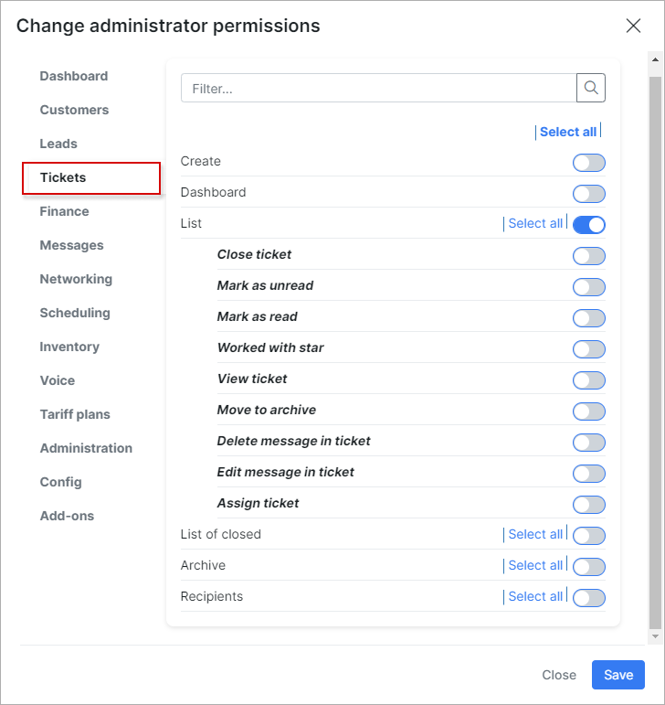

Engineers permissions for scheduling mobile application
=========

A minimal set of permissions within each section required for an engineering role (intended for technical workers engaged in direct installation and dismantling of equipment, using the app)

Part CRM:

CRM
========

* **Leads**
* **List**
* **List** / Show same partners leads
* **View**
* **View** / Edit
* **View** / View leads password
* **Maps**

Customers
========

* **Search**
* **List**
* **View**
* **Edit**
* **Edit** / Geodata
* **Edit** / Planned change status
* **Edit** / View customer password
* **Services**
* **Services** / Bundles
* **Services** / Internet services
* **Services** / Voice services
* **Services** / Custom services
* **CRM**
* **CRM** / Leads
* **CRM** / Edit leads info
* **Maps**

Tickets
========

* **List new & open**

Scheduling
========

* All permission exclude **Tasks-Delete**

Administration
========

* **Administrators**
* **Administrators**

Config
========

* **Scheduling** all permissions

