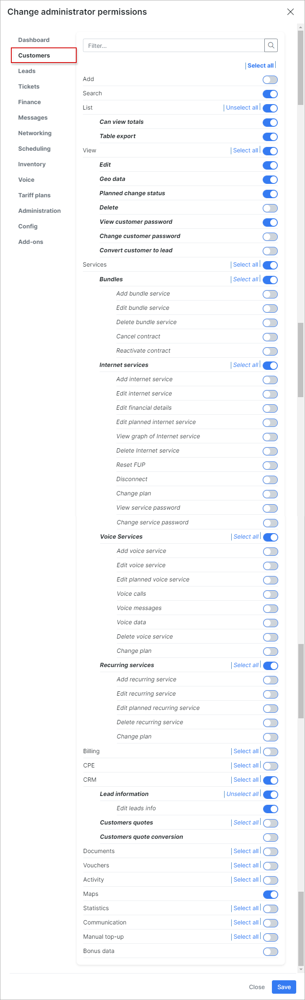
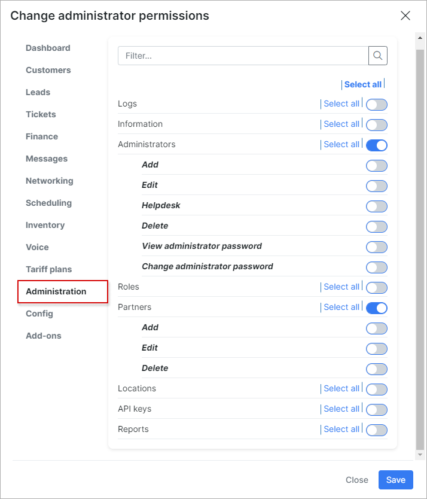

Engineers permissions for scheduling mobile application
=========

Navigate to `Administration → Administrators` and check the permission for the required account.

A **minimum set of permissions** within each section required for the engineer/technician role (intended for technical workers engaged in direct installation and dismantling of equipment, using the mobile app).

### CRM

* **Leads**
* **List** (Leads)
* **List** (Leads) / Show same partners leads
* **View**
* **View** / Edit
* **View** / View leads password
* **Maps**

### Customers

* **Search**
* **List**
* **View** / Edit
* **Edit** / Geodata
* **Edit** / Planned change status
* **Edit** / View customer password
* **Services**
* **Services** / Bundles
* **Services** / Internet services
* **Services** / Voice services
* **Services** / Recurring services
* **CRM**
* **CRM** / Lead information
* **CRM** / Edit leads info
* **Maps**

### Tickets

* **List new & open**

### Scheduling

* All permission except permission **Tasks** / Delete

### Administration

* **Administrators**
* **Partners**

### Config

* **Scheduling** all permissions

