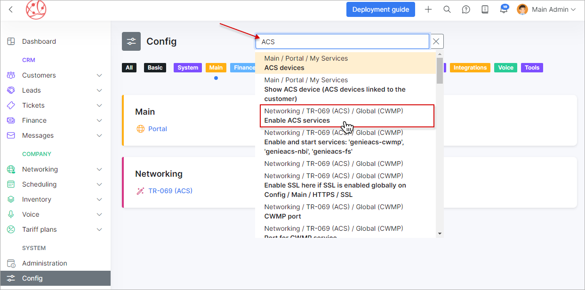
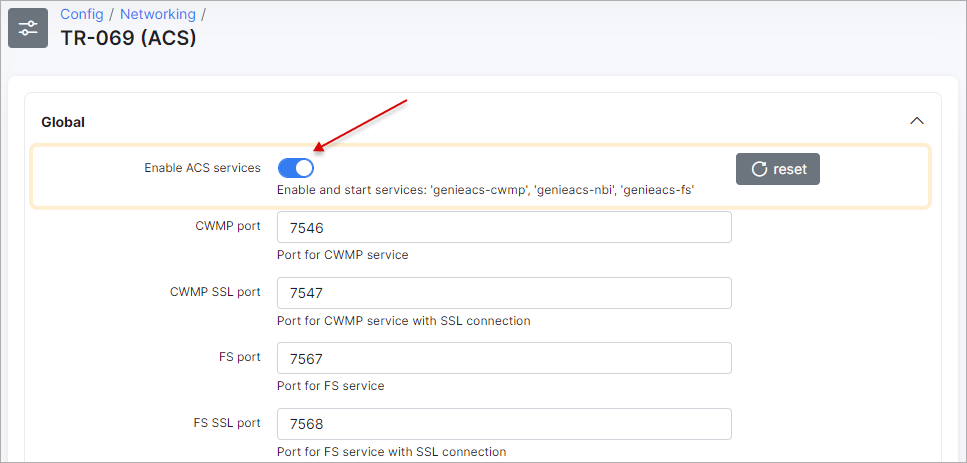

Configuration
=============

This is the section of global configurations of your Splynx server.

Please follow the links below for tutorials of each of the sections of *Config settings* page:

* [System](configuration/system/system.md)

* [Main](configuration/main_configuration/main_configuration.md)

* [Finance](configuration/finance/finance.md)

* [Networking](configuration/network/network.md)

* [Helpdesk](configuration/support/support.md)

* [Scheduling](configuration/scheduling/scheduling.md)

* [Leads](configuration/crm/crm.md)

* [Inventory](configuration/inventory/inventory.md)

* [Integrations](configuration/integrations/integrations.md)

* [Voice](configuration/voice/voice.md)

* [Tools](configuration/tools/tools.md)

If you are not sure where the required setting is located, use the search field to find it through all configurations. The necessary result of the search will be highlighted.

Example

