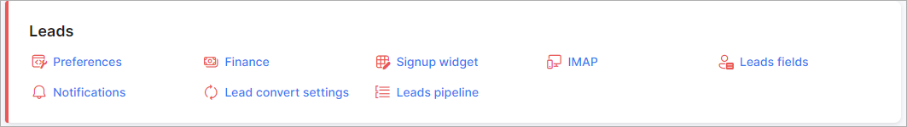

Customer relationship management(CRM)
=============

**_Config -> CRM_**

All the functionalities of the CRM module within Splynx can be configured to your preferences within the means of the available settings provided.

The following are the tutorials pages for each of the aspects available for configuration in the Splynx CRM module:

* [Finance](configuration/crm/finance/finance.md)

* [Leads stages](configuration/crm/leads_stages/leads_stages.md)

* [Preferences](configuration/crm/preferences/preferences.md)

* [Sign Up Widget](configuration/crm/sign_up_widget/sign_up_widget.md)
