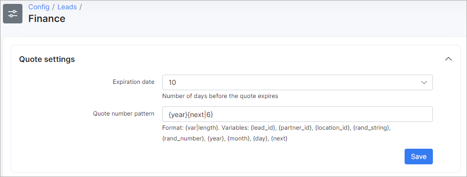

Finance
=============
**_Config -> CRM -> Finance_**

Below are the finance settings available for the CRM module.

# Quote settings
* **Expiration date** - number of days before the quote expires;

* **Quote number pattern** - format of quote numbers, this can be changed using variables from the description.

# Deals settings
* **Expiration date** - number of days before the deal expires.

# Conversion settings
* **Set default customer type for lead conversion**:
    * *Create active customer and invoice* - after the conversion of a lead to a customer, the status of the new customer will be "active" and an invoice will be created;

    * *Create inactive customer and proforma invoice* -  after the conversion of a lead to a customer, the status of the new customer will be "inactive" and a proforma invoice will be created.
