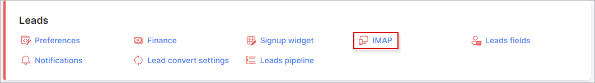
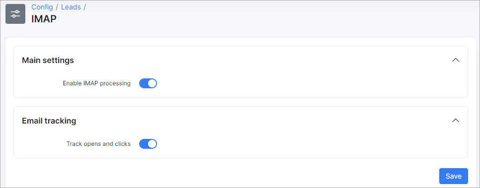
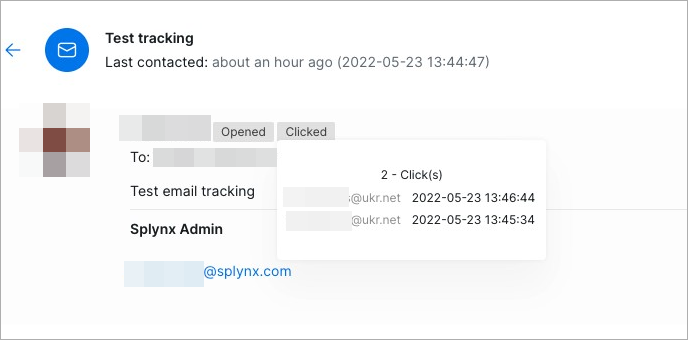

IMAP
=============

**Main settings:**

* **Enable IMAP processing** - enable/disable the option to correspond with the lead. All email threads will be available in the **Communication** tab of lead's profile;

**Email tracking:**

* **Track opens and clicks** - enable/disable the option to track whether an email has been opened and whether a lead has clicked any link located in the email body;

