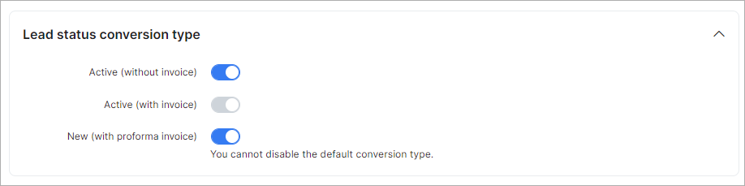

Lead convert settings
=============

**Lead status conversion type**

* **Active (without invoice)** - enable/disable the lead conversion type in the *Conversion settings* section to choose;

* **Active (with invoice)** - enable/disable the lead conversion type. This option is used by default;

* **New (with proforma invoice)** - enable/disable the lead conversion type.

**NOTE:**

- If the required lead conversion type is enabled and selected in the **Default customer type for lead conversion** drop menu, its toggle cannot be disabled;

- If the toggle for the required lead conversion type is disabled, such type cannot be selected in the **Default customer type for lead conversion** drop menu.

**Conversion settings**

**Default customer type for lead conversion:**

- **Create active customer and invoice** - after converting a lead to a customer, the status of the new customer will become `Active` and an invoice will be created. This option is used by default;

- **Create active customer** - after converting a lead to a customer, only the status of the new customer will be changed to `Active`;

- **Create active customer and proforma invoice** - after converting a lead to a customer, the status of the new customer will become `Active` and an proforma invoice will be created;

* **Default won status** - the default status that will be set for lead after conversion.
