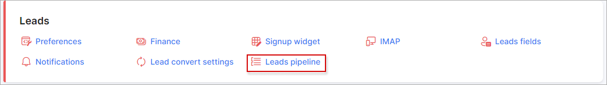
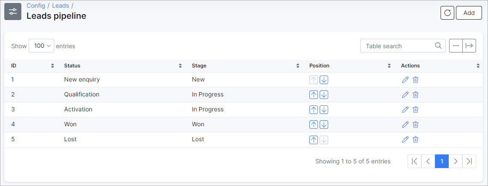
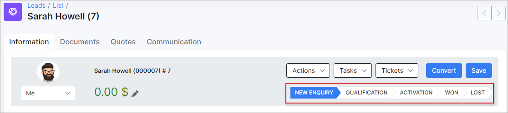
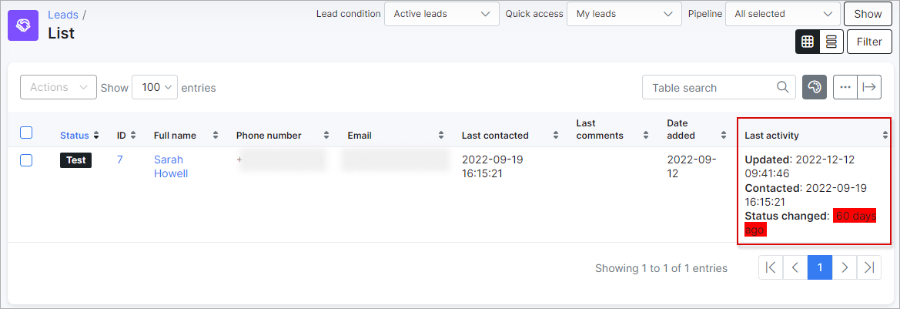

Leads pipeline
=============

The lead 'stages' can be added/removed or changed here:

**The default Leads Stages:**

- New
- In Progress
- Won
- Lost

**The default Leads Statuses:**

- New enquiry
- Qualification
- Activation
- Won
- Lost

To create a new status, click on the **Add** button and specify the details in a new window:

<icon class="image-icon"></icon> **NOTE:** 

If the **Due** value (number of days) is specified and a lead is in this status for more than the specified days, then in the leads list, in the **Last activity** column (should be enabled), the **Status changed** output will be highlighted in red color.

