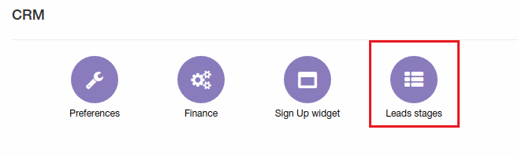
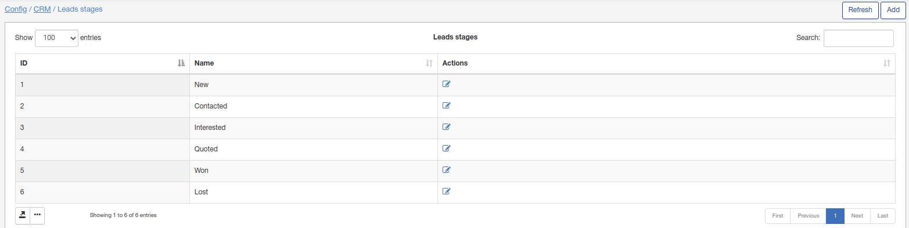
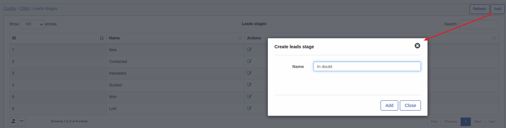
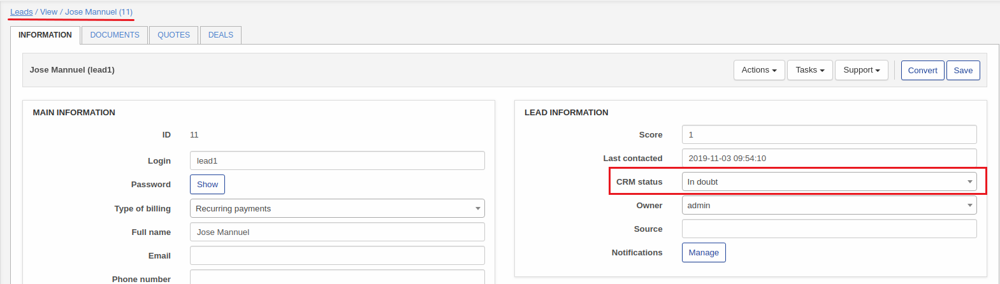

Lead stages
=============
**_Config -> CRM -> Lead stages_**

Lead *stages* used for leads can be added/removed or changed here.

All lead stages without the "delete" button, are the default stages of the system and cannot be removed, however, these stages can be renamed.

To add a new stage, click on the "Add" button and the create lead stage window will appear:

The New stage will be available for leads on your system:

