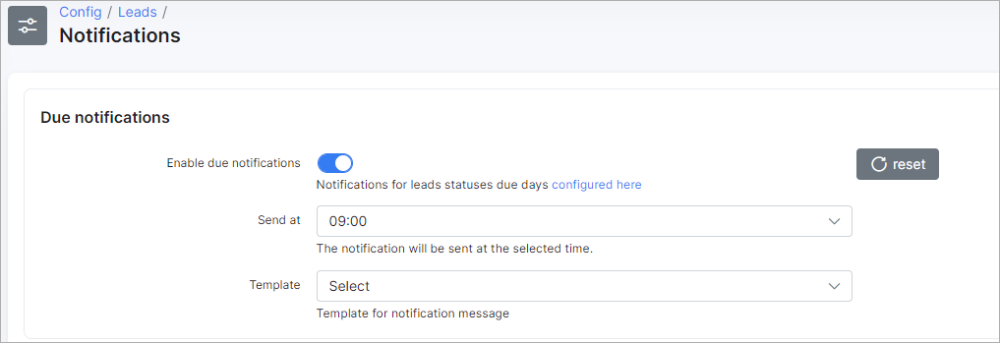
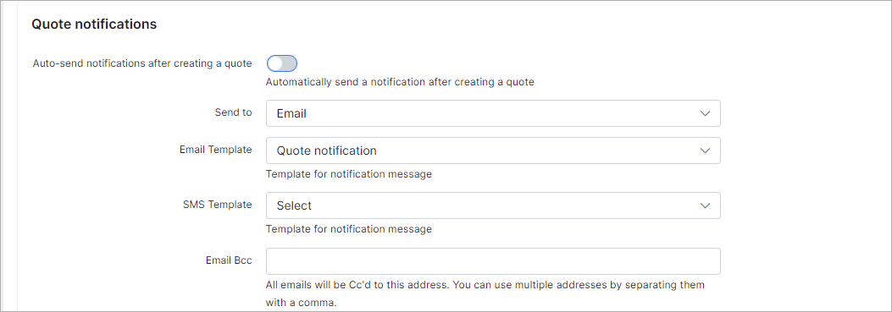

Notifications
=============

### Due notifications

* **Enable due notifications** - enable/disable the due notifications.  Notifications for leads statuses due days can be configured [here](configuration/crm/leads_pipeline/leads_pipeline.md). If the **Due** value is set, then at the specified time the administrator (leads owner) will receive an email with a list of leads in which the **status changed** output exceeds due days;

* **Send at** - select the time when the notification will be sent;

* **Template** - select the template for notification message.

### Reminder notifications

* **Template** - select the template for reminder notification message.

### Quote notifications

* **Auto-send notifications after creating a quote** - enable/disable automatic sending notifications to the lead after creating a quote;

* **Send to** - select a direction - `Email`, `SMS`, and `Email + SMS`;

* **Email Template** - select the email template for notification message;

* **SMS Template** - select an SMS template for notification message;

* **Email Bcc** - set an email to send copies of notifications, a list of recipients won't be visible for the lead. You can use multiple addresses by separating them with a comma;

* **Delay in sending notifications** - specify the delay in notification sending. The default value: `3` hours;

* **Notification days** - days that notifications can be sent out on. The notifications will be sent after the selected delay on the first available day and hour;

* **Notification hours** - hours that notifications can be sent out on. The notifications will be sent after the selected delay on the first available day and hour.
