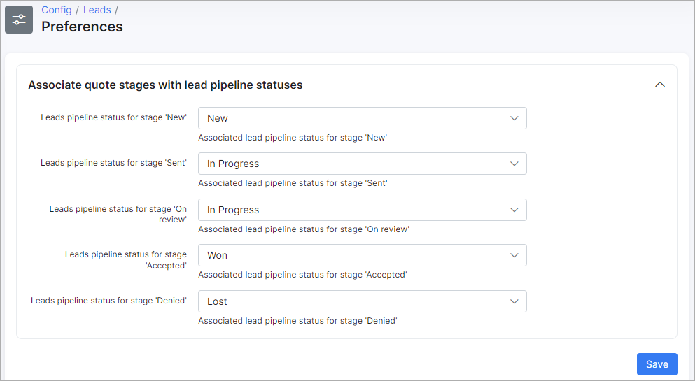
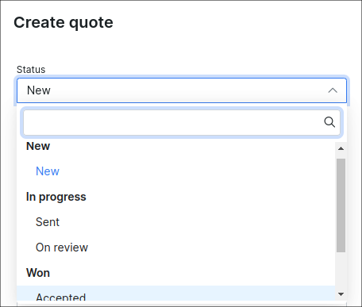

Preferences
=============

In this menu we can associate quote stages with lead pipeline statuses. The result can be checked during the creation of a quote under *Leads → List → Lead's name → Quotes*:

