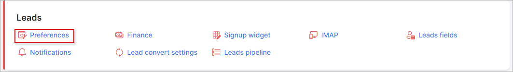
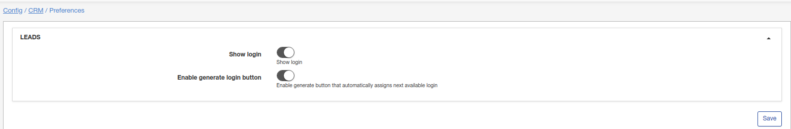
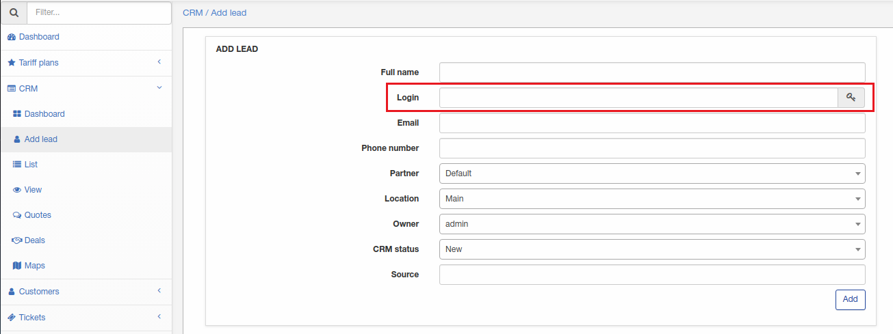

Preferences
=============
**_Config -> CRM -> Preferences_**

The following settings are configurable to your preference with regards to leads on the system.

* **Show login** - enable/disable login for lead;

* **Enable generate login button** - enable/disable button to auto-generate logins (this option only becomes visible if "Show login" enabled).

When a new lead will be added, the availability of the "Login" field will depend on the current/saved CRM preferences settings.
