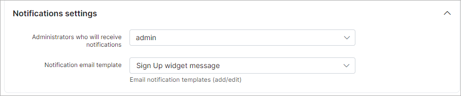

Sign Up widget
=============

We have developed this feature to support lead creation through other/company websites, directly on your Splynx server.

The result code can be copied to your website and potential customers can register for your services (become a lead in Splynx) directly on your website.

#### Form settings

Form details can be customized/changed here, the following fields are important and should be configured with special attention:

* **Use HTTPS** - if SSL configuration is set and your Splynx server uses HTTPS, this option must always be enabled;

* **Partner** - select the partner that the lead will be associated with;

* **Owner** - the administrator assigned or responsible for the lead, after the lead has been created through self-registration.

* **Include VAT in tariff price** - if enabled, the total price of the tariff plan including VAT will be displayed. If the **VAT included** option is enabled in the Internet tariff settings, the current option will be ignored;

* **Terms & Conditions template** - template can be created in `Config → Templates`, select **Type:** `Terms & conditions` and press the **Add** button.

#### Notifications settings

After the lead has registered, the Splynx administrator can receive an email notification. In this section select which administrator /-s will receive the notification and which template will be used

A **template for the notification** can be created in `Config → Templates`, select **Type:** `Email` and press **Add**.

#### Result code and Preview

After making the necessary changes in the *Form Settings* and *Form Fields* sections, please be sure to click on the **Save** button to apply these changes, after that the widget code will be generated with the parameters you configured.

Press the **Preview** button to check the result.

After filling in all the required fields, the lead will have to enter **Captcha** symbols and submit the form. The lead will then be created in Splynx.

#### Form fields

Fields can be managed with the available options in the table. We can add a new main/additional field, change its position, make the field required, delete the field, etc.

