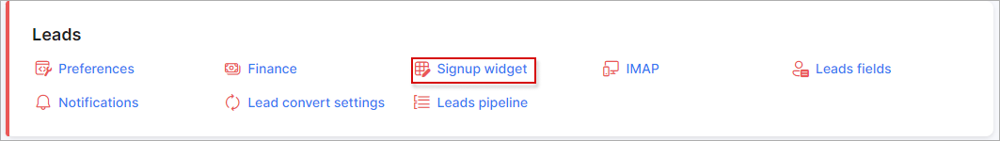

Sign Up widget
=============
**_Config -> CRM -> Sign Up widget_**

We have developed this feature to support lead creation via other/company websites, directly to your Splynx server.

The result code can be copied to your website and prospective customers will be able to register for your services (become lead in Splynx) directly on your website.  

# Required fields

These are mandatory fields to complete for prospective customers to register/sign up.

# Form settings

Form details can be customized/changed here, the following fields are important and should be configured with special attention:

* Use HTTPS - if SSL configurations are configured and your Splynx server is on HTTPS, this options should be enabled at all times;
* Partner - select the partner that the lead will be associated with;
* Owner - the administrator assigned to or responsible for the lead, After the creation of the lead via self-registration.

# Result code

After making changes, please be sure to click on the "Save" button to save these changes and the result code with your configured preferences will be ready for use.

We have added the ability to check what prospective customers will see on your website by means of the "Preview" button:

After completing all required fields, leads will have to enter Captcha and submit this form. Thereafter, the lead will be created in Splynx.
