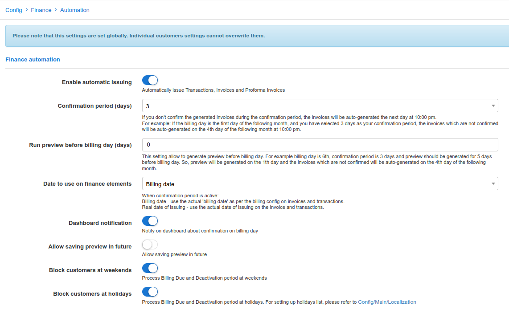
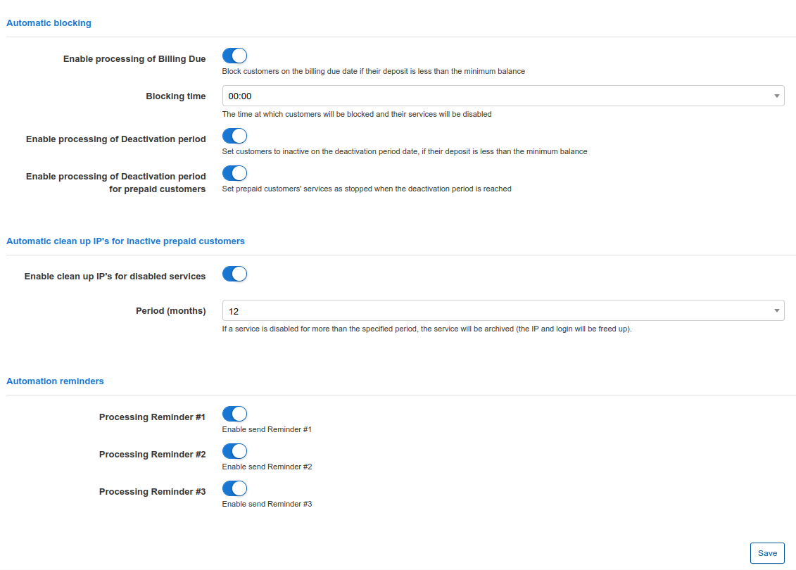

Automation
=============

To eliminate financial errors and delays caused by manual processes, in Splynx, you can configure finance automation in `Config → Finance → Automation`.
*Please note, these will be the global settings of the system*.

The following parameters can be configured for automation:

### Finance automation

* **Enable automatic issuing** - enables/disables automatic issuing of Invoices, Transactions, and Proforma Invoices;

* **Confirmation period(days)** - set the date for automatic confirmation of invoices/invoice batches to execute automatic issuing of invoices. If you don't confirm issuing during the configured number of days, invoices will be auto generated the next day after the confirmation period. The options to choose confirmation days are: 0, 3, 5, 10, 15, 20, 25 days;

* **Date to use on finance elements** - here you can configure the date of transactions and invoices issuing. It can be the billing day or the real date of issuing. For example, the billing day is on 1st day of the month and you have set  3 days as a confirmation period. In that case the invoice can be dated on the billing day regardless of confirmation days or the real date of issuing: maximum on the 4th day of the month (if you won't confirm issuing and invoices will be auto generated the next day);

* **Dashboard notification** - with this option enabled you will be notified on the Dashboard about confirmation on the billing day;

* **Allow saving preview in future** - enables/disables the ability to save previews of invoices for upcoming months/future dated months (`Finance → History`);

* **Weekend processing** - enables/disables processing of billing due and grace periods on weekends.

### Automatic blocking

* **Enable processing of  billing Due** - enabling this process will lead to blocking non-paying customers on their billing due date and when their deposit is less than the minimum deposit/minimal balance allowed;

* **Blocking time** - the time at which customers will be blocked and their services will be disabled;

* **Enable processing Grace Period** - with this option enabled, non-paying customers will be set to an inactive status by the end of their Grace periods and when their deposit is less than minimum deposit/minimal balance allowed;

* **Enable processing of Grace period for prepaid customers** - enabling this option will set prepaid customers' services as stopped when their grace period is reached. (Prepaid grace periods can be set under `Config / Finance / Billing settings`)

### Automatic services clean up
If a service is disabled and the customer is not active but the service has a static IP configured, we can automatically reset the IP of this service to make this IP available in pool.

* **Enable clean-up of inactive services** - enables/disables auto cleaning of inactive services;

* **Period(months)** - If a service is inactive for more than the specified period, the service will be archived/cleaned up (the IP and login will be freed up).

### Automation reminders

* **Processing Reminder #1** - with this option enabled, Reminder #1 will be sent to the customer on the day set in [Reminder settings](configuration/finance/reminders/reminders.md);
* **Processing Reminder #2** - with this option enabled, Reminder #2 will be sent to the customer on the day set in [Reminder settings](configuration/finance/reminders/reminders.md);
* **Processing Reminder #3** - with this option enabled, Reminder #3 will be sent to the customer on the day set in [Reminder settings](configuration/finance/reminders/reminders.md).
