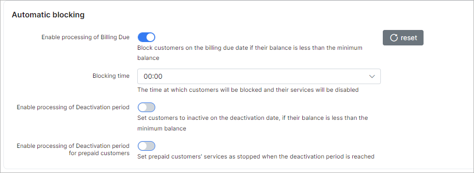

Automation
=============

To eliminate financial errors and delays caused by manual processes, in Splynx, you can configure finance automation in `Config → Finance → Automation`.

**NOTE:** **these settings are global and affect all customers in your Splynx**.

The following parameters can be configured on this page:

### Finance automation

* **Enable automatic issuing** - enables/disables automatic issuing of Invoices, Transactions and Proforma Invoices;

* **Confirmation period (days)** - set the time in days for automatic confirmation of invoices/invoice batches to execute their automatic issuing. If you don't confirm the generated invoices during the confirmation period (by default `3` days), the **invoices will be auto-generated the next day at 10:00 pm**. The values for choosing the confirmation days are: `0`, `3`, `5`, `10`, `15`, `20`, `25`, `30`, `last day of month`.

**Example**

If the billing day is the first day of the month and you use the default 3 days as your confirmation period, the invoices which are not manually confirmed will be auto-generated on the 4th day of the month at 10:00 pm.

* **Run preview before billing day (amount of days prior)** - (<icon class="image-icon"></icon> to start using the current parameter be sure that `Allow confirming a preview in the future` option is enabled) set the time in days to allow the finance preview generation before the billing day (by default `0` days).

**Example**

The billing day is 6th, confirmation period is 3 days and preview should be generated in 5 days before billing day. So, using `5` days value, preview will be generated on the 1th day and the invoices which are not confirmed will be auto-generated on the 4th day of the following month.

* **Date to use on finance elements** - choose which date will be used as actual one on the invoice and transactions. The available values: `billing day` or `real date of issuing`.

**Example**

The billing day is on 1st day of the month and you have set 3 days as a confirmation period. In this case, the invoice can be dated on the billing day regardless of confirmation days or the real date of issuing - maximum on the 4th day of the month (if you don't confirm issuing and invoices will be auto generated the next day);

* **Dashboard notification** - enable/disable the notification on Dashboard about confirmation of invoices on the day of billing;

* **Allow confirming a preview in the future** - enables/disables the ability to confirm a preview of invoices for upcoming months/future dated months (`Finance → History`);

* **Block customers on weekends** - enables/disables the processing of `Billing Due` and `Deactivation period` on weekends;

* **Block customers on holidays** - enables/disables the processing of `Billing Due` and `Deactivation period` on holidays. Navigate to `Config → Main → Localization` to set up the holiday list.

### Automatic blocking

* **Enable processing of Billing Due** - enable/disable the customers blocking on the the `Payment due` date if their balance is less than the minimum balance;

* **Blocking time** - the time when clients will be blocked and their services will be disabled;

* **Enable processing of Deactivation (grace) period** - set the recurring customers to **inactive** status on the the `Deactivation period` date if their balance is less than the minimum balance;

* **Enable processing of Deactivation (grace) period for prepaid customers** - set the prepaid customers' services as **stopped** status when the `Deactivation period` date is reached.

### Automatically remove IP's for inactive prepaid customers

If a service is disabled and the customer is not active but the service has a static IP address configured, we can automatically reset the IP address of this service to make this IP available in pool again.

* **Enable removing IP's for disabled services** - enables/disables auto removing the IP addresses for disabled services;

* **Period (months)** - if a service is disabled for more than the specified period in months (by default `12`), the service will be archived and its IP address and login will be freed up. The available values from `1` to `24`.

### Automation reminders

* **Static days** - days when to send reminders can be set up in each customer's profile individually. If this toggle is enabled, the '*Reminder # 1/2/3 days*' values will be replaced with the system default ones where Reminder #1 = 3 days; Reminder #2 = 5 days; Reminder #3 = 7 days. The default values will also be set in the [reminders settings](configuration/finance/reminders/reminders.md) for all customers in Splynx;

* **Processing Reminder #1** - with this toggle enabled, Reminder #1 will be sent to the customer on the day set in [Reminder settings](configuration/finance/reminders/reminders.md);

* **Processing Reminder #2** - with this toggle enabled, Reminder #2 will be sent to the customer on the day set in reminder settings;

* **Processing Reminder #3** - with this toggle enabled, Reminder #3 will be sent to the customer on the day set in reminder settings.
