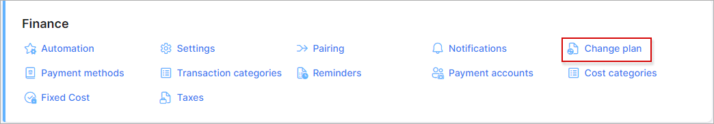

Change plan
===============

In this sections, the options for **Recurring** and **Prepaid (Custom)** services can be configured.

These settings can be customized for each partner in the system. Simply create a new [partner](administration/main/partners/partners.md) in Splynx, select the necessary partner to work with at the top right corner of the page and set the required settings.

<icon class="image-icon"></icon> The fields marked with `*` sign have the different values from original ones (original values are related to **Default** partner).

The options description:

#### Recurring

* **Plan change refund** - choose the type of refund to be given to customers when performing the `change plan`, the options are the next: `None`, `Refund unused money`;

* **Additional fee when changing to a more expensive plan** - specify the amount to be taken when a customer switches to a higher cost plan;

* **Additional fee when changing to a less expensive plan** - specify the amount to be taken when a customer switches to a lower cost plan;

* **Create invoice after service change** - the available options: `During next billing cycle`, `Immediately till end of active month` and `Immediately till end of next month`;

* **Minimum invoice amount** - if the total of the new invoice is less than this value, the invoice will not be created.

******************************************************************

#### Prepaid (Custom)

* **Plan change refund** - choose the type of refund to be given to customers when performing the `change plan`, the options are the next: `None`, `Rollover unused data` and `Refund unused money`;

* **Rollover expiration** - specify how many months rollover data is valid for. The options are the following: `None`, `End of period` and from `1` to `12` values;

* **Additional fee when changing to a more expensive plan** - specify the amount to be taken when a customer switches to a higher cost plan;

* **Additional fee when changing to a less expensive plan** - specify the amount to be taken when a customer switches to a lower cost plan.

