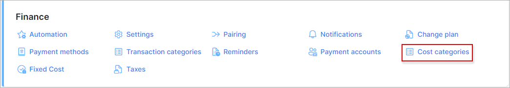
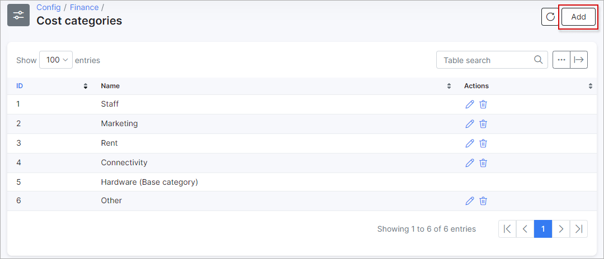

Cost categories
====

In this section we can configure categories for fixed company expenses.

To set up cost categories navigate to `Config → Finance → Cost categories`.

These categories can be used in [Fixed costs](configuration/finance/fixed_costs/fixed_costs.md) for accounting of company expenses.

