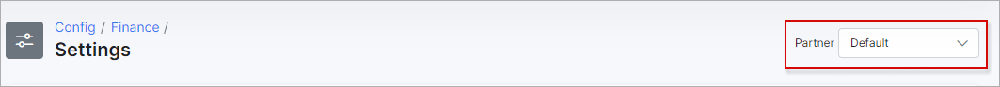
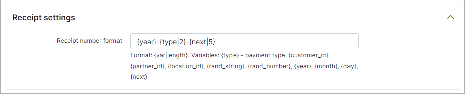
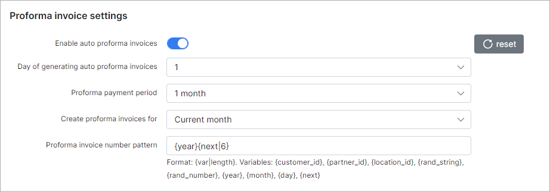

Finance settings
=============

To set global financial settings for new customers or to update existing customers navigate to `Config → Finance → Settings`.

Global parameters for the following important parts of the financial module can be configured here:

In right top corner of the page, select the partner for which you wish to change billing settings.

----
### Billing settings
#### *Recurring type of billing is set by default in Splynx global configuration.* 

* **Billing Enabled** -  enables/disables billing for the customer;

* **Period** -  it can be prepaid or postpaid, which means in Prepaid Mode recurring Invoices can be issued up to 5 months in advance and in Postpaid Mode Invoices will be generated after services usage;

* **Payment Method** - select a Payment Method for recurring payments, such as Cash, Bank Transfer, Credit Card, PayPal, Refill Card, BrainTree and others if installed and configured;

* **Billing day** - when the customer will be charged. It is a day of Invoice generation.
If the 'use date of creating customer' options is enabled - the billing day will be set to the day the customer was created;

* **Billing due** - the last day customers have to make payments before getting blocked. For example, if we choose the 1st day of the month as the billing day and the 15th day of the month as the Billing due day, Invoices will be generated on the 1st day of the month and if customer don't make payments by the 15th day of the month, the customer will be blocked on the 16th day of the month. Even though the customer will have a blocked status, their services will be still accounted;

* **Grace Period** - when the customer's services will be disabled and the customer will be given an inactive status, after the customer has been blocked. For e.g. it could be 10 days, which means 10 days after the customer has been blocked, the customer's status will automatically be changed from blocked to inactive and their services will not be accounted;

* **Minimal balance** - defines the minimum amount of funds to be available in the customers account at all times, after service charges, to avoid being blocked and is set, by default, to "0" in Global configuration, but it is possible to change it here according to your needs;

* **Send finance notifications** - enables/disables sending of notifications about payments, invoices, overdue invoices etc;

* **Payment calendar** - enables/disables payment calendars under the customers "Billing" tab.

### Billing prepay settings

* **Grace period** - select the amount of days prepaid customers have to make payments after their service expiration dates/being blocked, to avoid being marked as inactive.

### Receipt settings

* **Receipt number pattern** - create a payment receipt number pattern here.

#### Invoices settings

* **Create Invoices(after Charge&iInvoice)** - with this option enabled **Invoices will be issued automatically** after charging the customer using the "Charge&Invoice" button in the billing overview tab of the customer;

* **Auto pay Invoices from account balance** - enables/disables the automatic paying of services from the customers account balance, you can enable this option if customers' payments are regularly made from their account balance;

* **Allow pay invoice from account balance(with negative account balance)** - enables/disables the ability to pay invoices from the customer's account balance when the customers balance is or will be a negative amount;

* **Invoice number pattern** - you can set up an Invoice number pattern here;

* **Invoice cache** - enables/disables invoice caching on the system, with this option enabled, all changes made will be visible only in new invoices, old Invoices will remain without changes;

* **Force create invoice if transaction "To invoice" exists** - enables/disables the creation of invoices from transactions with the "to invoice" option enabled.

### Proforma Invoice settings

These are the parameters for auto generating Proforma Invoices. In our billing system Proforma Invoices can be used as a request of payment in advance. For example, it can be created 1 month before the recurring payment, so you will see if the customer is able to pay the Proforma Invoice. When the proforma invoice is created, the customer’s balance doesn't changed. The main reason for this billing approach is to prevent the payment of VAT tax for non-paying customers. If the customer pays the amount specified in the Proforma Invoice PDF, the company can issue a tax Invoice thereafter.

* **Enable Auto Proforma Invoices** - with this option enabled Proforma Invoices will be issued automatically;
* **Day of generating Auto Proforma Invoices** - select the day for automatic issuing of Proforma Invoices;
* **Period** - select the period to generate proforma invoice for;  
* **Create Proforma Invoices for** - there are 2 options here: create proforma invoice for current month or for the next month;
* **Proforma Invoice number pattern** - create a Proforma Invoice number pattern here.

## Mass update of customers' billing Settings

Using the mass update tool, billing settings can be configured for multiple amounts of customers at once instead of manually changing billing settings for each customer. Be very attentive when using this tool. Here are a few examples on how to use it:

**Task 1**: disable billing for the partner "Person" and for customers using the billing type = recurring:

After billing was disabled in settings click on "Update existing customers" select the partner, billing type and only the "billing enabled" value and click on the "Update" button.

**Task 2** : Change the billing day for all existing customers.

Using the same logic select all partners, all billing types and just the value "billing day" for Attributes to update and click on the "Update" button.
