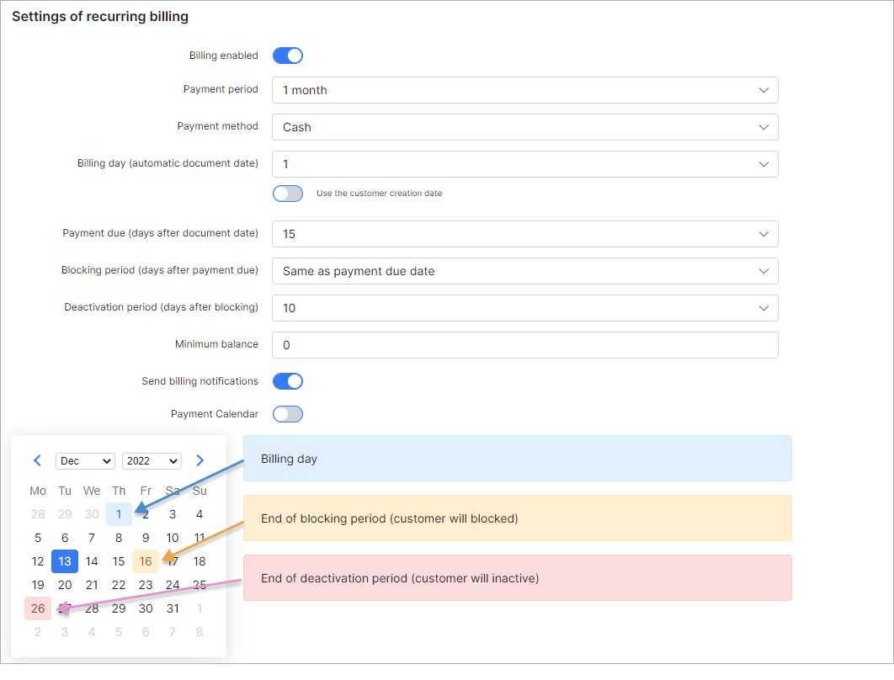
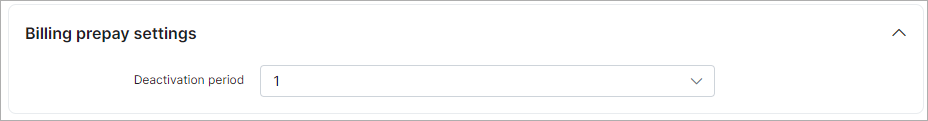
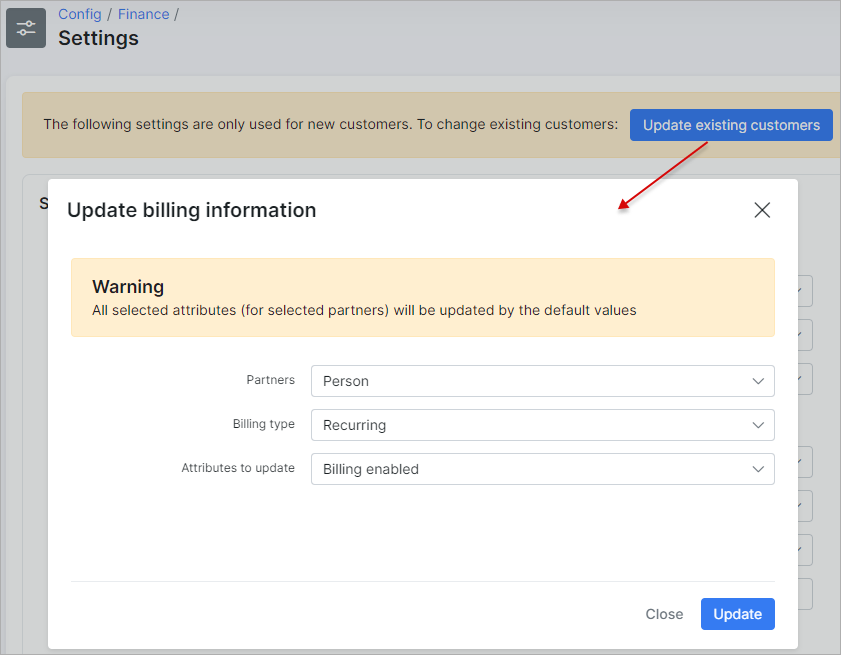

Finance settings
=============

To set global financial settings for new customers, to update existing customers or related to specific partner navigate to `Config → Finance → Settings`.

The settings of **Recurring**/**Prepaid (Custom)**/**Prepay** billing, **Receipt**/**Invoices**/**Proforma Invoice** of the financial module can be configured here:

In the right top corner of the page, you can select the [partner](administration/main/partners/partners.md) for which you wish to change billing settings.

----

### Settings of recurring billing

**Recurring type of billing is set by default in Splynx global configuration**

* **Billing Enabled** -  enables/disables billing for the customer;

* **Payment period** -  it can be **prepay** (from 1 to 12 months) or **postpaid**, which means that in prepay mode recurring invoices can be issued up to 12 months in advance and in postpaid mode invoices will be generated after services usage;

* **Payment method** - select a [payment method](configuration/finance/payment_methods/payment_methods.md) for recurring payments, such as **Cash**, **Bank transfer**, **Credit card**, **Refill Card** and others if installed and configured;

* **Billing day** - when the customer will be charged. It is a day of Invoice generation. If the `Use the customer creation date` option is enabled - the billing day will be set to the day the customer was created;

* **Payment due (days after billing day)** - the last day customers have to make payments before getting blocked. For example, if we choose the 1st day of the month as the billing day and the 15th day of the month as the billing due day, invoices will be generated on the 1st day of the month and if customer don't make payments by the 15th day of the month, the customer will be blocked on the 16th day of the month. **Even though the customer will have a blocked status, their services will still be accounted**;

* **Deactivation period (days after blocking) (Grace period)** - the number of days after the customers' services will be disabled and the customer will be given an inactive status, after the customer has been blocked. For example, it could be 10 days, which means 10 days after the customer has been blocked, the customer's status will automatically be changed from blocked to inactive and service will not be accounted;

* **Minimal balance** - defines the minimum amount of funds to be available in the customers account at all times, after service charges, to avoid being blocked and is set, by default, to `0`. It can be changed to another value according to your needs;

* **Send billing notifications** - enables/disables sending of notifications about payments, invoices, overdue invoices etc;

* **Payment calendar** - enables/disables payment calendars under the customer's `Billing → Billing overview` tab.

### Billing Prepaid (Custom) settings

* **Issue invoice after payment** - enables/disables the immediate creation of invoice for the full amount of payment after payment is received. All other invoices for prepaid customers will be disabled and all work will be performed with transactions;

* **Text of item** - the text that will be added as a description of the service into the created invoice;

* **Tax** - the [tax](configuration/finance/taxes/taxes.md) value to be used with the created invoice and included in its total;

* **Auto associate payments to invoice** (use this option only if `Issue invoice after payment` toggle is disabled) - enables/disables the auto linking payments to invoice (invoice number will be added to the payment) if the amount of payment is equal to the total sum of the invoice, only for *Prepaid (Custom) billing* type. For example, administrator created one-time invoice worth $30, if customer add to the balance $30, this payment will be linked with previously created invoice and the invoice will be considered as paid. If the payment amount is not equal to the total of the invoice, e.g the payment is only $15, it will be added to the customer's balance, with a sufficient amount of money on the balance, the invoice will be paid from it.

### Billing prepay settings

* **Deactivation period (Grace period)** - the number of days in which prepaid customers have to make payments after the service was stopped to avoid being marked as inactive. You might also be interested in [The clarification of statuses relation (customer, service and invoice)](customer_management/customer_services/customer_services.md) information section.

### Receipt settings

* **Receipt number format** - create a payment receipt number pattern here, the default is `{year}-{type|2}-{next|5}`. The next values can be used: `{var|length}` for the format; `{type} - payment type, {customer_id}, {partner_id}, {location_id}, {rand_string}, {rand_number}, {year}, {month}, {day}, {next}` for the variables.

**Note:** Finance format can be configured in [Localization](configuration/main_configuration/localization/localization.md)

### Invoices settings

* **Auto create invoices** - with this option enabled invoices will be issued automatically after charging the customer using the `Charge & Invoice` button in the *billing overview* tab of the customer;

* **Auto pay invoices from account balance** - enables/disables the automatic paying of service from the customer's account balance, the payment will be completed if there are enough funds on the balance. The **option is deprecated in Splynx v3.2**, Now, this **option is always enabled by default** for all customers;

* **Allow pay invoice from account balance (with negative account balance)** - enables/disables the option to pay invoices from the customer's account balance when the customers balance is or will be with a negative amount of funds;

* **Invoice number format** - you can set up an invoice number pattern here, the default is `{year}{partner_id|2}{next|6}`. The next values can be used: `{var|length}` for the format; `{customer_id}, {partner_id}, {location_id}, {rand_string}, {rand_number}, {year}, {month}, {day}, {next}` for the variables;

* **Invoice cache** - enables/disables invoice caching on the system, with this option enabled, all changes made will be visible only in new invoices, old Invoices will remain without changes;

* **Force creating an invoice if a transaction with 'To Invoice' exists** - enables/disables the creation of invoices from transactions with the `Add to invoice` option enabled;

* **Auto associate payments to invoice** - enables/disables the auto linking payments to invoice (invoice number will be added to the payment) if the amount of payment is equal to the total sum in the invoice, **only for Recurring billing type where an invoice is created first, and then a payment is received**. If the amount of the payment does not match the amount of the invoice, the invoice will be paid (only if `Auto pay invoices from account balance` option is enabled in customer's profile) from the client's account balance.

### Proforma Invoice settings

These are the parameters for auto generating Proforma Invoices. In our billing system Proforma Invoices can be used as a request of payment in advance. For example, it can be created 1 month before the recurring payment, so you will see if the customer is able to pay the Proforma Invoice. When the proforma invoice is created, the customer’s balance doesn't changed. The main reason for this billing approach is **to prevent the payment of VAT tax for non-paying customers**. If the customer pays the amount specified in the Proforma Invoice PDF, the company can issue a tax Invoice thereafter.

* **Enable Auto Proforma Invoices** - with this option enabled Proforma Invoices will be issued automatically;
* **Day of generating Auto Proforma Invoices** - select the day of the month for automatic issuing of Proforma Invoices;
* **Payment period** - select the period to generate proforma invoice for;  
* **Create Proforma Invoices for** - there are 2 options here: create proforma invoice for current month or for the next month;
* **Proforma Invoice number format** - create a Proforma Invoice number pattern here, the default is `{year}{next|6}`. The next values can be used: `{var|length}` for the format; `{customer_id}, {partner_id}, {location_id}, {rand_string}, {rand_number}, {year}, {month}, {day}, {next}` for the variables.

## Mass update of customers' billing settings

Using the mass update tool, billing settings can be configured for multiple amounts of customers at once instead of manually changing billing settings for each customer. Be very attentive when using this tool. Here are a few examples on how to use it:

**Task 1**: *enable billing for the partner "Person" and for customers using the billing type = recurring*:

After the `billing` option was disabled in **Settings of recurring billing** click on **Update existing customers** select the necessary values for partner, billing type and only one - `Billing Enabled` attribute and click on the **Update** button.

**Task 2** : *change the billing day for all existing customers*:

After the `Billing day` value was changed, select all partners, all billing types and only one - `Billing day` attribute and click on the **Update** button.

