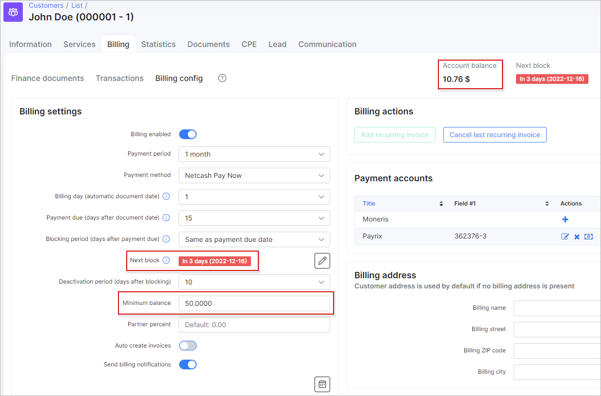
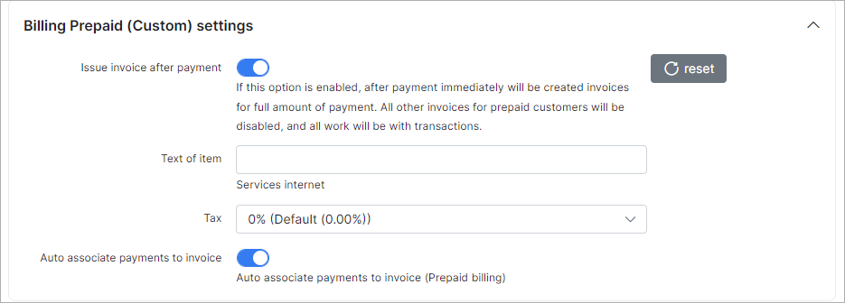
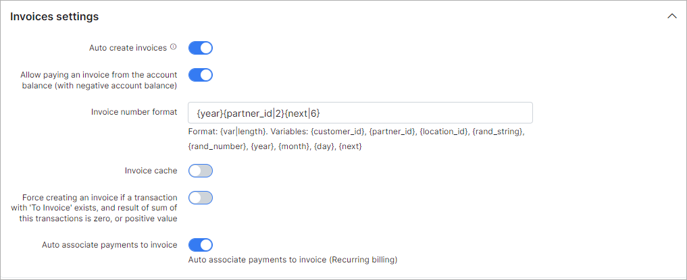

Finance settings
=============

To set global financial settings for new customers, to update existing customers or related to specific partner navigate to `Config → Finance → Settings`.

The settings of **Recurring**/**Prepaid (Custom)**/**Prepay** billing, **Receipt**/**Invoices**/**Proforma Invoice** of the financial module can be configured here.

In the right top corner of the page, you can select the [partner](administration/main/partners/partners.md) for which you wish to change billing settings.

----

### Settings of recurring billing

**Recurring type of billing is set by default in Splynx global configuration**

* **Billing Enabled** -  enables/disables billing for the customer;

* **Payment period** -  it can be **prepay** (from 1 to 12 months) or **postpaid**, which means that in prepay mode recurring invoices can be issued up to 12 months in advance and in postpaid mode invoices will be generated after services usage;

* **Payment method** - select a [payment method](configuration/finance/payment_methods/payment_methods.md) for recurring payments, such as **Cash**, **Bank transfer**, **Credit card**, **Refill Card** and others if installed and configured;

* **Billing day (automatic document date)** - day of the month when the customer will be charged and an invoice will be generated. If the `Use the customer creation date` option is enabled - the billing day will be set to the day the customer was created (default value is the `1`st day of the month. The available values are from `1` to `28`);

<b style="color: #FD841F;">Explanation of the Billing day</b>

Billing day is the automatic date of invoice creation and also the start of the billing period (for one month).
Example: Setting to 1 means billing from 1st to end of month and 10 means billing from 10th to the 9th of the next month. 

<b style="color: #FD841F;">Why is the billing date limited to 28 days?</b>

The billing day value is limited to 28 to allow us to create invoices on the same day of every month consistently. Thus limited to 28 because of February.
Should you wish to create invoices on any day between the 29th and 31st you can choose between the 28th or the 1st to create your invoices on these days instead.

<b style="color: #FD841F;">Explanation on the actual start of the billing cycle</b>

The start of the actual billing cycle, however, (from which date the customer will be billed from) is determined by the service start date, this will always pro-rate from the service start date to the end of the first billing cycle and then continue to bill as per the normal billing period.
Example A: If a customer service start date is 15 March and the billing day is set to 1, an invoice generated in March will show the customer being billed from 15 March - 31 March, the next invoice will show 1 April - 30 April etc.
Example B: If a customer service start date is 15 March and the billing day is set to 1, an invoice generated in April will show the customer being billed from 15 March - 30 April.

<b style="color: #FD841F;">Creating invoices on a different date</b>

If you would like to create an invoice on a different date to that of the billing day then the History and Preview tool should be used to create the invoice preview batch on a desired day.
Example: If you would like to create the invoice batch for April, on the 25th of March, then you would navigate to the history and preview tool on the 25th of March, select 1 April as the Date and click preview. This will create the batch which can be previewed and ultimately confirmed once you are satisfied with the data. All invoices and transactions will then be created and invoices will be sent according to the configured notification settings.

* **Payment due (days after document date)** - the last day customers have to make payments before getting blocked. For example, if we choose the 1st day of the month as the billing day and the 15th day of the month as the payment due day, invoices will be generated on the 1st day of the month and if the customer doesn't make payments by the 15th day of the month, the customer will be blocked on the 16th day of the month. **Even though the customer will have a blocked status, their services will still be accounted** (default value is `15` days after `billing day`. The available values are from `1` to `28`). From Splynx v4.0, the current option cannot be disabled in the select menu, that solved the problem when the invoices with `overdue` status could be created from scratch;

* **Blocking period (days after payment due)** - allows to extend the period when the customer will be blocked (by default the value is `0` days. The available values are `Do not block`, `Same as payment due date` and from `0` to `99` days). The option `Do not block` allows to disable customer blocking after `Payment due` date, if the option is enabled, the customer deactivation won't work as well;

* **Deactivation period (days after blocking) (Grace period)** - the number of days after the customers' services will be disabled and the customer will be given an inactive status, after the customer has been blocked. For example, a default value is `10` days (can be set from `1` to `99` days or `disabled` as well), which means 10 days after the date when customer has been blocked, the customer's status will be automatically changed from blocked to inactive and service won't be accounted;

* **Minimum balance** - defines the minimum amount of funds that must be available in the customer account balance at any time, even after the service charge, in order to avoid blocking. The default value is `0`. This value can be changed to another according to your needs. The negative value (e.g. `-50`) is allowed to use as well;

<b>Example</b>

A **minimum balance** is the minimum amount of money that the customer has to keep on their balance, maintaining a minimum balance will allow customer to avoid being blocked on the next day after Billing due. It means a customer balance cannot drop below the specified amount at any time during billing cycle.

For instance, a customer uses some Internet service (e.g. its price is 100 USD) and has the next settings on Billing overview tab:
- Billing day = 1;
- Billing due = 15;

The recurring invoice will be auto generated on the 1st day of the next month. And imagine that the customer will pay 100 USD for the invoice on the same day.

If we have `0` (zero) value as a minimum balance requirement, a customer won't be blocked, because their balance will be equal to the set value.
If customer balance becomes negative, the customer will be blocked on the 16th day of the month.

If we have `50` value as a minimum balance requirement, the customer needs to pay 150 USD for the invoice to keep 50 USD on the balance to avoid blocking. If the customer has less than 50 on the balance, they will be blocked.

If we have `-50` value as a minimum balance requirement, a customer can pay only 50 USD for the invoice, because it's allowed to have a negative balance, but no less (`-60`, `-70` etc.) than`-50`. Pay attention, if a customer pays 60 USD, the account balance will be `-40` that is acceptable value. Even if a customer pays the full price for the invoice, the account balance will be equal to `0` and, as a result, a zero value will be greater than the allowed minimum balance.

* **Send billing notifications** - enables/disables sending of notifications about payments, invoices, overdue invoices etc;

* **Payment calendar** - enables/disables payment calendars under the customer's `Billing → Billing config` tab.

### Billing Prepaid (Custom) settings

* **Issue invoice after payment** - enables/disables the immediate creation of invoice for the full amount of payment after payment is received. All other invoices for prepaid customers will be disabled and all work will be performed with transactions;

* **Text of item** - the text that will be added as a description of the service into the created invoice;

* **Tax** - the [tax](configuration/finance/taxes/taxes.md) value to be used with the created invoice and included in its total;

* **Auto associate payments to invoice** (use this option only if `Issue invoice after payment` toggle is disabled) - enables/disables the auto linking payments to invoice (invoice number will be added to the payment) if the amount of payment is equal to the total sum of the invoice, only for *Prepaid (Custom) billing* type. For example, administrator created one-time invoice worth $30, if customer add to the balance $30, this payment will be linked with previously created invoice and the invoice will be considered as paid. If the payment amount is not equal to the total of the invoice, e.g the payment is only $15, it will be added to the customer's balance, with a sufficient amount of money on the balance, the invoice will be paid from it.

### Billing prepay settings

* **Deactivation period** - the number of days in which prepaid customers have to make payments after the service was stopped to avoid being marked as *Inactive*. You might also be interested in [The clarification of statuses relation (customer, service and invoice)](customer_management/customer_services/customer_services.md) information section.

### Receipt settings

* **Receipt number format** - create a payment receipt number pattern here, the default is `{year}-{type|2}-{next|5}`. The next values can be used: `{var|length}` for the format; `{type} - payment type, {customer_id}, {partner_id}, {location_id}, {rand_string}, {rand_number}, {year}, {month}, {day}, {next}` for the variables.

<icon class="image-icon"></icon> Finance format can be configured in [Localization](configuration/main_configuration/localization/localization.md).

### Invoices settings

* **Auto create invoices** - with this option enabled, invoices will be issued automatically after charging the customer using the `Charge & Invoice` button in the *billing overview* tab of the customer;

* **Allow paying an invoice from the account balance (with negative account balance)** - enables/disables the option to pay invoices from the customer's account balance when the customers balance is or will be with a negative amount of funds;

* **Invoice number format** - you can set up an invoice number pattern here, the default is `{year}{partner_id|2}{next|6}`. The next values can be used: `{var|length}` for the format; `{customer_id}, {partner_id}, {location_id}, {rand_string}, {rand_number}, {year}, {month}, {day}, {next}` for the variables;

* **Invoice cache** - enables/disables invoice caching on the system, with this option enabled, all changes made will be visible only in new invoices, old Invoices will remain without changes;

* **Force creating an invoice if a transaction with 'To Invoice' exists** - enables/disables the creation of invoices from transactions with the `Add to invoice` option enabled;

* **Auto associate payments to invoice** - enables/disables the auto linking payments to invoice (invoice number will be added to the payment) if the amount of payment is equal to the total sum in the invoice, **only for Recurring billing type where an invoice is created first, and then a payment is received**. If the amount of the payment does not match the amount of the invoice, the invoice will be paid (only if `Auto pay invoices from account balance` option is enabled in customer's profile) from the client's account balance.

### Proforma Invoice settings

These are the parameters for auto generating Proforma Invoices. In our billing system, Proforma Invoices can be used as a request of payment in advance. For example, it can be created 1 month before the recurring payment, so you will see if the customer is able to pay the Proforma Invoice. When the proforma invoice is created, the customer’s balance isn't changed. The main reason for this billing approach is **to prevent the payment of VAT tax for non-paying customers**. If the customer pays the amount specified in the Proforma Invoice PDF, the company can issue a tax Invoice thereafter.

* **Enable auto proforma invoices** - with this option enabled Proforma Invoices will be issued automatically;
* **Day of generating auto proforma invoices** - select the day of the month for automatic issuing of proforma invoices;
* **Proforma payment period** - select the period to generate a proforma invoice for;  
* **Create proforma invoices for** - there are 2 options here: create proforma invoice for current month or for the next month;
* **Proforma invoice number pattern** - create a proforma invoice number pattern here, the default is `{year}{next|6}`. The next values can be used: `{var|length}` for the format; `{customer_id}, {partner_id}, {location_id}, {rand_string}, {rand_number}, {year}, {month}, {day}, {next}` for the variables.

### Credit notes settings

* **Credit note number pattern** - create a credit note number pattern here, the default is `{year}{partner_id|2}{next|6}`. The next values can be used: `{var|length}` for the format; `{customer_id}, {partner_id}, {location_id}, {rand_string}, {rand_number}, {year}, {month}, {day}, {next}` for the variables.

## Mass update of customers' billing settings

Using the mass update tool, billing settings can be configured for multiple amounts of customers at once instead of manually changing billing settings for each customer. Be very attentive when using this tool. Here are a few examples on how to use it:

**Task 1**: *enable billing for the partner "Person" and for customers using the billing type = recurring*:

After the `billing` option was disabled in **Settings of recurring billing** click on **Update existing customers** select the necessary values for partner, billing type and only one - `Billing Enabled` attribute and click on the **Update** button.

**Task 2** : *change the billing day for all existing customers*:

After the `Billing day` value was changed, select all partners, all billing types and only one - `Billing day` attribute and click on the **Update** button.

